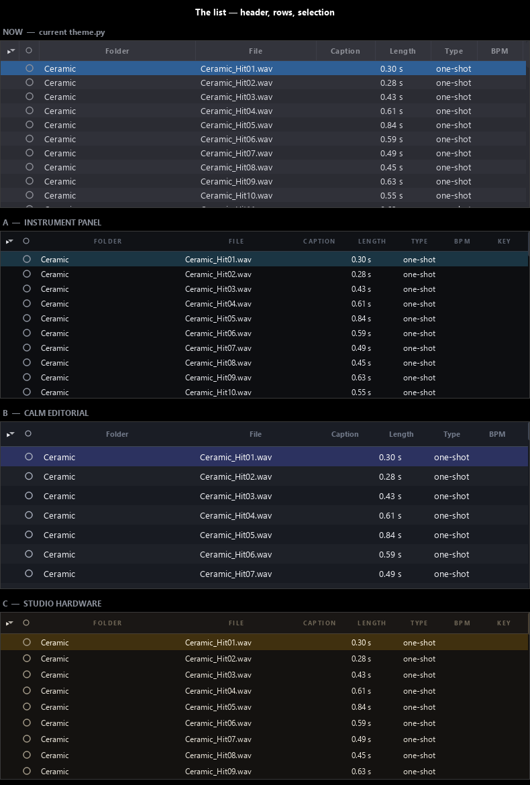
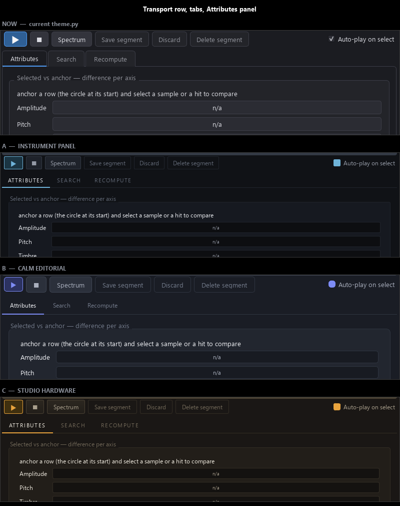
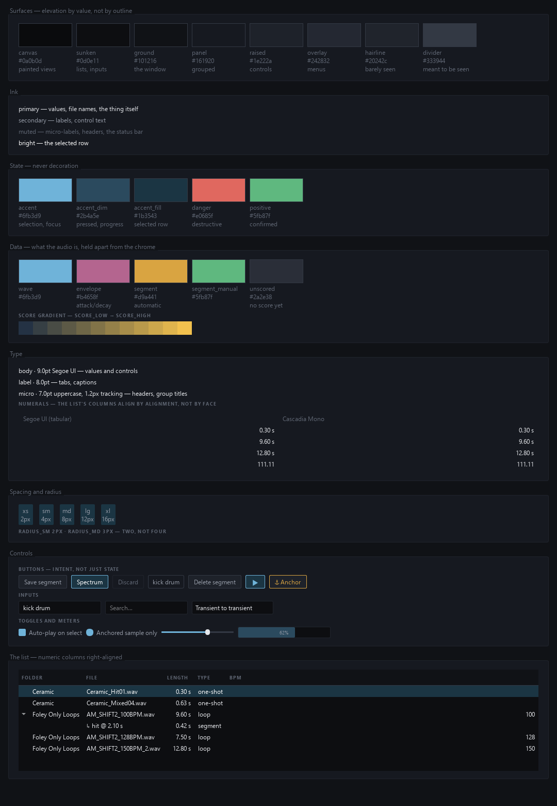

# Design studies — towards a design system for Crate

*2026-09-10 · rendered by `scripts/design_studies.py` against a 943-sample index, `Ceramic_Hit01.wav` selected, 1600×950 · images in `.docs/design/`, regenerable with `uv run python scripts/design_studies.py --variant all`*

The user, on the beta: *"it needs much sleeker UI — is there any way we could build a design system specifically for Crate?"* This is the first step: a diagnosis of the window as it stands, a token layer as the thing `theme.py` never had, and three directions rendered against the real window so one can be chosen by looking. **Direction A (instrument panel) was chosen** — the record of why is below.

*The diagnosis and the three directions below were written before anything was built; the **Built** section near the end records what landed the same day.*

## What the current window does well

`theme.py` (2026-09-07, spec §9.1) already holds the hard-won part. One palette, one style sheet, applied once, and the painted views (`mapview`, `waveform`, `tagbars`, `vectorstrip`, the list delegates) import the same colour constants so the window reads as one surface. Across the whole application there is **exactly one raw hex literal outside `theme.py`** — `_UNSCORED` in `mapview.py:35`.

That discipline is why this is additive work, not a rewrite. What is missing is every layer *above* colour.

## Diagnosis

1. **One accent doing every job.** `ACCENT` (`#4f9cf5`) is the selection bar, the waveform, the play button, the tag bars, the tab underline and the focus ring. When everything is emphasised, nothing is.
2. **A value ramp squeezed into five near-identical steps** — `BG #1b1c21` → `PANEL #232429` → `FIELD #2b2c33` → `RAISED #33343c`, spanning about 24 levels of lightness — with a 1px `BORDER #3d3e48` on nearly every widget. Elevation is carried by outlines instead of value, which reads as flat and fussy simultaneously.
3. **No spacing scale.** `setContentsMargins(6, 4, 6, 2)` next to `(4, 4, 4, 4)`, spacing `2` next to `8`, and a header height of `max(112, 3 * button.sizeHint().height() + 2 * 2 + 6 + 8)`. Every layout negotiates its own margins.
4. **No type hierarchy.** Everything is Segoe UI 10pt apart from the group-box titles.
5. **Ragged control rows.** The transport row is ▶, ■, *Spectrum*, *Save segment*, *Discard*, *Delete segment* and a floating checkbox — six controls each sized to its own text, ungrouped, with destructive *Delete segment* indistinguishable from benign *Spectrum*.
6. **Inconsistent density between the halves.** The left panel is airy (form rows, boxed groups, a whole row spent on `—` plus the *Caption* button); the right list is dense at 21px rows. They do not read as one product.
7. **The loudest pixels carry the least information.** The vector strip under the tag bars is the highest-contrast element in the window; it is ambient context, not a focal point.
8. **Glyph icons.** ▶ ■ ▸ ▾ ⚓ ↳ are text, so they cannot be tinted per state and shift with the font.

### One thing that is *not* wrong

Numbers in the list look misaligned, but **Segoe UI's digits are already tabular** — `111.11` and `000.00` both measure 38px at 10pt. The Length and BPM columns are simply left-aligned, so values of different digit counts start at the same left edge. That is an alignment fix, not a typeface one; a monospace face for readouts is a style choice, not a correctness one.

## The token layer

`Tokens` in `scripts/design_studies.py` is the proposed shape. Surfaces run darkest to lightest as **canvas → sunken → bg → panel → raised → overlay**, wide enough that a step in value replaces a border. `line` is a hairline that should barely register; `line_strong` a divider meant to be seen. Text splits into `text / text_dim / text_mute / text_bright`, state into `accent / accent_dim / accent_fill` plus `danger` and `positive` — and, importantly, **data colours are held separately from chrome colours**: `segment`, `envelope`, `score_low`, `score_high` describe audio, not UI, and today share one namespace with it.

One detail the study made explicit: `theme.BG` is used by the painted views as the **canvas** (what the map and waveform draw on) *and* by the style sheet as the **window ground**. Those want to be different values. The current module cannot express the distinction.

### What Qt actually supports

Checked before being relied on, rather than assumed:

| Property | Qt QSS | Note |
|---|---|---|
| `text-transform: uppercase` | **yes** | verified by rendering, not by width alone |
| `letter-spacing` | **yes** | `SCOPE` at 10pt: 39px → 54px at 3px tracking |
| `font-variant: small-caps` | **yes** | renders as true small caps |
| `box-shadow` | **no** | elevation must be a step on the surface ramp |
| transitions / animation | **no** | motion needs explicit `QPropertyAnimation` per widget |

The absence of shadows and transitions is not much of a loss here — value-based elevation is the better answer for a dense dark tool, and spec §9.6's "nothing expensive runs automatically" argues for very little motion anyway.

## The three directions

**A — instrument panel.** Near-black ground, hairlines instead of boxes, uppercase micro-labels at 7pt with 1.2px tracking, one restrained accent reserved for state, alternating rows off.

**B — calm editorial.** Wider contrast, generous consistent spacing, sentence-case headings at 10pt, real card elevation, alternating rows on.

**C — studio hardware.** Warm ground, bevelled gradient controls, amber accent and readouts.

### Measured

In the same 250px of vertical space, **NOW and A both fit ten rows; B fits seven; C fits nine.** A additionally pulls the **Key** column into view that the current theme pushes off the right edge — smaller header type plus tighter section padding buys a whole column. For a browser over 110,000 files (spec §3), B's roughly one-third loss of rows per screen is a real cost, and it is what settled the choice.

A also drops the alternating stripes, reduces the per-section header borders to one hairline, and replaces the saturated full-width selection bar with a quiet fill. The list stops being a texture.

## The finding that matters most

**The transport row is equally ragged in all four renders.** *Spectrum* / *Save segment* / *Discard* / *Delete segment* remain four different widths, ungrouped, with the destructive action still indistinguishable from the benign ones. The Attributes panel is five label-plus-empty-bar rows in every direction. The tag bars are unchanged in every direction.

That is the ceiling of a token layer: it fixes colour, density, type and material — roughly the top third of the diagnosis — and cannot touch items 5, 6, 7 or 8. Those are **component** problems. A design system for Crate therefore needs four layers, not one:

1. **Tokens** — `src/crate/design.py`, with `theme.py` deriving from it while keeping every constant it exports today, so the painted views keep working untouched.
2. **Components** — `SegmentedControl` (the stacked List/Map buttons), `Toolbar` with grouping and button intents (`primary` / `quiet` / `danger`), `IconButton` over SVG rather than glyphs, `Meter` (tag bars and difference bars, one implementation), `Chip`, `SectionHeader` (small-caps plus hairline, retiring the `QGroupBox` border), `StatusPill`, and a collapsible `HelpText` so prose like the Recompute tab's paragraph stops sitting in primary UI.
3. **A painting kit** — shared ramp LUTs, `hairline()`, `focus_ring()`, `axis_ticks()`, so the map, waveform, spectrogram and list delegates read as the same material as the widgets rather than each inventing its own treatment.
4. **A gallery** — every token and component in every state on one page, so the look can be iterated in seconds without launching against a full index, screenshotted offscreen, and regression-tested.

## Adjustments to A before it is built

- **The selection is now slightly too quiet.** Add a 2px accent left-edge on the selected row so it reads at a glance without the heavy fill returning.
- **The waveform still touches the panel edges** and leaves a large dead zone under the decay — a paint-kit fix: vertical inset, centre line, fit to content.
- **The vector strip is still the loudest element** even under A. It needs to drop to a low-contrast texture.

## Incidental finding: offscreen screenshots were never legible

`QFontDatabase.families()` returns `[]` under `QT_QPA_PLATFORM=offscreen` on this machine. Metrics stay correct — a 10pt label still measures 323×19 — so tests that assert sizes are unaffected, but **every glyph rasterises as a tofu box**. Every "screenshot checked" in the journal to date was checked against boxes.

`QFontDatabase.addApplicationFont(r"C:\Windows\Fonts\segoeui.ttf")` fixes it and works fine under offscreen. `load_fonts()` in the study script does this for seven faces. Any offscreen grab meant to be *looked at* rather than measured needs it first — and it is also the argument for shipping the typeface with the application rather than depending on Segoe UI being installed.

## Built (2026-09-10, same day)

Layers 1 and 4 landed straight after the studies: `src/crate/design.py` holds direction A as tokens, `theme.py` derives every constant it exports from there, and `crate --gallery` opens the page below.

Three things settled in the building:

* **`mapview.py`'s `_UNSCORED` is gone** — it was the app's last raw hex, and `data.unscored` is now its home. Every colour in the application resolves through `design.py`.
* **`text-transform` does not reach `QGroupBox::title`.** It works on a `QLabel`, and the old theme's group-title rule had carried a `text-transform: uppercase` that never did anything. The rule no longer claims it; `QLabel#sectionHeader` is the real uppercase micro-label, and replacing the boxes with a `SectionHeader` component is the component layer's job. A test asserts the rule stays honest.
* **Fusion is not observable after `setStyleSheet`** — Qt wraps the style in a `QStyleSheetStyle` whose `baseStyle()` PySide6 does not expose. `test_apply_theme_applies_both_channels_and_repeats_cleanly` asserts the palette, font and style sheet instead.

`seguisym.ttf` joined `FONT_FILES`: without it the ⚓ and ↳ glyph icons rasterise as boxes offscreen, which is itself a small argument for the component layer's SVG icons.

**A note on the comparison sheets above.** They are the historical record of the choice, rendered before `design.py` existed. Because `theme.py` now derives from the tokens, re-running `--variant baseline` renders the *shipped* direction, not the pre-token theme — so the sheets are not reproducible and should not be regenerated. `--variant gallery` regenerates `gallery.png`, which should be.

## Next

Direction A is chosen and built. Layers 1 and 4 are done. Next is layer 2 — the components — built against the gallery: `SegmentedControl`, `Toolbar` with grouping and intents, `IconButton` over SVG, `Meter`, `Chip`, `SectionHeader`, `StatusPill`, `HelpText`. Then layer 3, the painting kit. Then panel-by-panel conversion, starting with the transport row and the Attributes tab as the worst offenders — which is also where the three adjustments to A get made. This is a polish track alongside the roadmap in spec §12 — it does not displace Phase 10.
