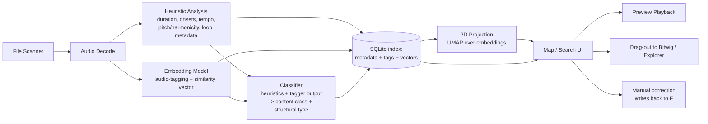

# Sample Library Search & Mapping Tool — Project Documentation

## Sample proposal #1

Status: **Draft for review** — this is a proposal, not a locked spec. Open questions are called out at the end; the plan is expected to shift once you push back on it.

---

## 1. Purpose

You produce music in Bitwig Studio 6.1 and have a large sample collection (thousands of files) at `D:\_soundPacks`. The collection is too large to browse by folder-diving, and Bitwig's own file browser is not built to help you find "a sound like this one" across a heterogeneous, non-uniformly-tagged library.

**Goal:** build a standalone desktop application that lets you *find the right sample fast* by:

1. Automatically classifying every sample against a taxonomy that matches how you actually think about your sounds (rhythmic hits, rhythmic loops, melodic loops, vocals).
2. Placing samples on an explorable "map" where acoustically/perceptually similar sounds sit near each other, so you can browse by ear/eye instead of by folder name.
3. Letting you pick any sample and ask "find me more like this."
4. Getting the chosen sample into Bitwig with minimal friction (drag-and-drop).

**Explicit non-goals** (per your framing):

- This is **not** a sampler, drum machine, or playable instrument. No pads, no kit-building, no slicing/mangling engine.
- It does not need to replace Bitwig's browser for every workflow — just for the "I know the vibe I want but don't know which file it's in" problem.
- No cloud dependency required. This is a local tool over a local library.

---

## 2. Prior Art (so we're not reinventing something you already own)

Worth naming plainly, since some of this may change the scope decision:

- **Algonaut Atlas 2** (your reference point): a granular/sample-playback instrument plugin with a 2D similarity pad for arranging one-shots (and some loops) within a kit. Strong at "play and mangle a curated set of ~dozens-to-hundreds of hits," weak at "index and search my entire multi-thousand-file library" — it's built around per-instance kits inside a plugin window, not a persistent whole-library index, and it's a closed commercial product you can't extend or retag to your own taxonomy.
- **Sononym**: closest existing prior art to what you're describing — a standalone (non-plugin) sample browser with acoustic similarity search, keyword/tag search, and DAW drag-out, built specifically for large local libraries. If you haven't tried it, it's worth a quick look before committing engineering time here — it may cover 70% of this out of the box. That said, its similarity model and taxonomy aren't customizable to your specific categories, its development pace has reportedly slowed, and (most importantly) a self-built tool gives you full control over the taxonomy, the similarity model, and future features. I'm not certain of its current purchase/support status — verify before treating it as a fallback.
- **XLN Audio XO**: a drum-specific plugin with a 2D similarity pad for one-shots only. Good UX reference for the "map" interaction, but scoped to drums-as-instrument, not a general library search tool, and again a plugin, not a browser.
- Everything else in this space (Splice's cloud search, Serato Sample) is cloud-catalog search over *their* library, not yours — not applicable here.

**Takeaway:** the interaction model you want (2D similarity map + facet filters + "find similar" + drag-out) is a known-good pattern; there just isn't a good non-plugin, fully-customizable, locally-run version of it that matches your taxonomy. That's the gap this project fills.

---

## 3. Proposed Solution Overview

A standalone desktop app (working title: **"Crate"** — placeholder, rename freely) that:

1. **Scans** `D:\_soundPacks` recursively (read-only — never modifies or moves your original files).
2. **Analyzes** each audio file: extracts structural facts (duration, onsets, tempo/loop-ness, pitch content) and a numeric "sound embedding" that captures its timbre/character.
3. **Classifies** each sample into your taxonomy (below), using a mix of signal-processing heuristics and a pretrained audio-tagging model, with your ability to correct mistakes.
4. **Indexes** everything into a local database.
5. Presents a **map view** (2D, similarity-based layout, filterable/colorable by category) and a conventional **search/filter view**, both backed by the same index.
6. Lets you **preview** (audio playback), **select "find similar"** on any sample, and **drag the file straight into Bitwig**.

The app never touches Bitwig's own project files or database — it only reads your sample folder and, on drag, hands Bitwig a file path the same way Explorer would.

---

## 4. Taxonomy Design

Rather than forcing every sample into one rigid category tree, the taxonomy is modeled as **two independent facets** plus tags. This matters because your own description already has two dimensions tangled together (content type, and hit-vs-loop structure) — keeping them separate makes the classifier's job easier and makes filtering more powerful.

### Facet A — Content class
| Class | Description |
|---|---|
| **Rhythmic** | Drum hits, foley, synthetic percussive hits, drum/music loops |
| **Melodic** | Synth/instrument recordings, tonal loops and phrases |
| **Vocal** | Spoken word, vocal one-shots/adlibs, vocal phrases/loops |
| **Other** *(recommended addition)* | Textures, drones, risers/impacts, ambiences, foley that isn't hit-like, anything that doesn't cleanly fit above — a deliberate catch-all so the classifier isn't forced to mislabel edge cases. You mentioned three categories; in practice a library with "thousands of samples" almost always has a residue of things that fit none of them, and giving that residue a home keeps it from polluting the other three. |

### Facet B — Structural type
| Type | Description | How it's detected |
|---|---|---|
| **One-shot** | Short, single transient | Short duration + one dominant onset |
| **Multi-hit** | Longer, multiple transients, but still reads as "a hit" not "a loop" (most foley, synth hits) | Few onsets, no steady periodicity, no loop metadata |
| **Loop** | Long, many transients, tempo-syncable | Many onsets with periodic spacing, detectable tempo, and/or embedded loop metadata |

Every sample gets **one content class + one structural type** (e.g. "Rhythmic / Loop", "Vocal / One-shot", "Melodic / Loop"), plus optional free-text tags (instrument name, mood, source pack) either auto-suggested or manually added. This is exactly your original 1a/1b/1c/2/3 list, just factored so the map/filter logic can reuse the structural axis across content classes instead of duplicating it three times.

The **map's spatial layout is driven by acoustic similarity** (see §5), not by taxonomy — taxonomy becomes color-coding and filters on top of that layout. This is the key design decision that answers your brief directly: the map shows *what sounds like what*, while facets let you constrain *which kind of thing* you're looking at within that similarity space.

---

## 5. System Architecture



Pipeline stages, in plain terms:

1. **Scanner** walks the folder tree, finds audio files, skips non-audio (Kontakt `.nki`, Battery/EXS presets, REX files that aren't raw PCM, etc. — logged, not silently dropped, so you can see what got skipped), and dedupes by content hash so re-running the scan after adding new packs only processes new/changed files.
2. **Heuristic analysis** extracts cheap, fast, deterministic signals: duration, onset count/positions, tempo estimate + confidence, harmonic/percussive energy ratio, and — importantly — **embedded WAV metadata** (`acid`/`smpl` chunks). A large fraction of commercial loop packs embed authoritative tempo/key/loop-point data directly in the file; reading that when present is far more reliable than estimating it from audio, and is nearly free.
3. **Embedding model** produces a fixed-length numeric vector per sample capturing its timbral/perceptual character — this is what "similarity" means computationally, and what the map's layout and "find similar" are built on. See §6 for model choice.
4. **Classifier** combines heuristics + the embedding model's own audio-tagging output (most audio-tagging models already emit labels like "Speech," "Drum," "Guitar," etc. as a side effect) to assign content class and structural type. Low-confidence samples are flagged for you to confirm rather than silently guessed.
5. **Index** is a local SQLite database: one row per sample with its metadata, tags, and embedding vector.
6. **2D projection** (UMAP) compresses the high-dimensional embedding space down to map coordinates, recomputed when the library changes materially (not on every single scan).
7. **UI** reads from the index; map and filter/search are two views over the same data, not two separate systems.

---

## 6. Technology Stack Recommendation

| Component | Recommendation | Why | Alternatives considered |
|---|---|---|---|
| Language | **Python** | Best-in-class audio/ML ecosystem (librosa, soundfile, torch), fast to iterate, good enough performance for an analysis-once/browse-often tool | Rust (faster, much more dev effort for marginal runtime gain here) |
| Desktop UI | **PySide6 (Qt)** | Native look, proper OS drag-and-drop (real file drag into Bitwig, not just visual), good performance for a canvas with thousands of points, one process/one language (no Electron+Python IPC complexity) | Electron+React (nicer web-style UI, but drag-out-to-native-app and thousands-of-points rendering are more fragile; adds a second language/runtime) |
| Audio I/O & classic features | **librosa + soundfile** | Mature, pure-Python-installable on Windows (unlike Essentia, whose Windows wheels are unreliable), covers onset/tempo/pitch/HPSS out of the box | Essentia (richer feature set but real Windows packaging risk — flagged as a risk, not chosen) |
| Similarity embeddings | **CLAP** (e.g. `laion-clap`) as primary, **PANNs (CNN14)** as a lighter fallback | CLAP embeddings work well across percussive/tonal/vocal content and — as a bonus — support **zero-shot text search** later ("find something like a metallic clang") even without a reference sample. PANNs is lighter-weight/faster if CPU-only performance becomes a bottleneck | OpenL3, VGGish (both viable, less flexible, no text-search upside) |
| Dimensionality reduction | **UMAP** | Preserves local + global structure better than t-SNE for this kind of browsing map, scales fine to tens of thousands of points | t-SNE (slower, less stable across re-runs) |
| Storage | **SQLite** (single file, e.g. `crate.db`) | Zero-ops, portable, trivially backed up, plenty fast for this row count; vectors stored as blobs, nearest-neighbor done in-process (numpy, or `hnswlib` if the library grows large enough to need approximate NN) | A dedicated vector DB (Chroma/LanceDB) — overkill at this scale, adds a dependency for no real benefit |
| Playback | **sounddevice** or Qt Multimedia | Simple low-latency preview playback | — |

**Rough performance expectation:** CLAP embedding extraction is the slowest step (a transformer forward pass per file). On CPU, budget roughly a fraction of a second to a couple of seconds per file depending on length and hardware — for a few thousand files, that's a one-time background job measured in tens of minutes, not something you wait on interactively. If you have an NVIDIA GPU available, this drops substantially. The scan itself should support resuming/incremental runs so this cost is paid once per file, not once per session.

---

## 7. Data Model (sketch)

```
samples
  id, filepath, file_hash, filename, folder, duration_s,
  sample_rate, channels, added_at, last_scanned_at

analysis
  sample_id (FK), tempo_bpm, tempo_confidence, onset_count,
  is_loop (bool), key (nullable), harmonic_ratio,
  embedded_metadata_json  -- raw acid/smpl chunk data if present

classification
  sample_id (FK), content_class, structural_type,
  confidence, is_user_confirmed (bool), classified_at

embedding
  sample_id (FK), model_name, vector (blob), map_x, map_y

tags
  id, name
sample_tags
  sample_id (FK), tag_id (FK)   -- free-text/auto-suggested tags, many-to-many

crates            -- optional saved selections, see §9
  id, name, created_at
crate_samples
  crate_id (FK), sample_id (FK)
```

---

## 8. UX / Map Design

- **Map view**: a 2D canvas, one point per sample, positioned by UMAP coordinates (i.e., by acoustic similarity — nearby points sound alike). Points colored by content class (Rhythmic/Melodic/Vocal/Other), optionally sized or shaped by structural type. Pan/zoom for a few thousand points; click a point to preview, double-click or drag to send to Bitwig. Selecting a point highlights its nearest neighbors in the current similarity space — this is the "find me more like this" interaction.
- **Filter/search panel** (always visible alongside the map, not a separate mode): checkboxes/toggles for content class and structural type, a text field for filename/tag search, range sliders for duration/tempo. Filtering dims or hides non-matching points on the map rather than losing the spatial context.
- **List/grid view**: a conventional sortable table (filename, duration, tempo, key, class, tags) for when browsing-by-list is faster than browsing-by-map — same underlying filter state as the map.
- **Preview player**: click-to-play, spacebar-to-stop, waveform strip, no scrubbing complexity needed — this is a search tool, not an editor.
- **Correction workflow**: any sample's class/type can be manually overridden from either view; overrides are sticky (never re-guessed by a later re-scan) and — longer-term — usable as light supervision to improve the heuristic thresholds.
- **Crates (optional, lightweight)**: named, saved subsets of samples (e.g. "kick candidates for track X") — not a competitor to Bitwig's own project, just a scratchpad for narrowing a search session down before dragging things out.

---

## 9. Bitwig Integration

Bitwig doesn't expose a public API for injecting tags into its own browser database, so integration is intentionally kept simple and robust rather than deep:

- **Primary: native drag-and-drop.** The app hands the OS a real file path on drag (Qt's native `CF_HDROP` support on Windows), so dragging a point off the map directly onto a Bitwig track, the arranger, or a device slot works exactly like dragging from Explorer — because from Bitwig's perspective, it is.
- **Secondary: "reveal in Explorer" / copy path**, for workflows where drag isn't convenient.
- **Optional: crate export to a folder** — writing a folder of hardlinks (same-volume, no duplicated disk space) representing the current crate/search result, which you can point Bitwig's own file browser at as a normal location if you want a result set to persist inside Bitwig's browser across sessions.
- **Explicitly out of scope**: a Bitwig Controller Script or VST3 bridge for tighter in-DAW integration. Possible later, but it's a different, riskier engineering surface (Bitwig's extension API is Java-based, a second language/runtime) and drag-and-drop already solves the actual stated need.

---

## 10. Development Plan (Phased Roadmap)

Each phase produces something usable on its own — this is meant to be built incrementally, not as one big-bang release.

**Phase 0 — Foundations**
Project scaffold, dependency management, `git init`, decide on the app's real name, confirm tech stack (this document). Deliverable: empty app window that can point at `D:\_soundPacks`.

**Phase 1 — Ingestion & Metadata**
File scanner (recursive walk, format filtering, hashing/dedupe, incremental re-scan), SQLite schema, read embedded WAV metadata (acid/smpl chunks). Deliverable: a populated database of every sample with basic file metadata, browsable as a plain sortable list — no classification or map yet, but already more useful than Explorer for a flat search.

**Phase 2 — Heuristic Analysis**
Onset detection, tempo/loop-ness estimation, harmonic/percussive ratio, structural-type assignment (one-shot/multi-hit/loop). Deliverable: structural facet fully working and filterable.

**Phase 3 — Embeddings & Classification**
Integrate the audio-tagging/embedding model, derive content class (Rhythmic/Melodic/Vocal/Other) from tagger output + heuristics, store embedding vectors. Deliverable: full taxonomy (both facets) populated automatically, with confidence flags on uncertain samples.

**Phase 4 — Map View**
UMAP projection, interactive 2D canvas, color-coding, "find similar" via nearest-neighbor in embedding space. Deliverable: the core "map" experience from your brief, working end-to-end.

**Phase 5 — Search, Filter, Preview**
Filter panel wired to both map and list views, text/tag search, audio preview playback, manual correction UI. Deliverable: a complete, standalone search tool — arguably the MVP finish line.

**Phase 6 — Bitwig Integration**
Native drag-out, reveal-in-Explorer, crate export. Deliverable: the tool is now usable in a real production session, not just for browsing.

**Phase 7 — Scale & Polish Hardening**
Performance pass for the full library size (background scanning UX, progress reporting, incremental re-scan on new packs, index rebuild strategy), error handling for corrupt/exotic files, general UI polish.

**Phase 8 — Stretch goals (post-MVP, not committed)**
- Zero-shot text search ("find something like a warm analog pad") via CLAP's text encoder.
- Near-duplicate detection to help clean up a library that likely has redundant packs.
- Auto key/BPM display matched against the current Bitwig project tempo (read-only convenience, e.g. via clipboard or a small helper — needs research, not assumed feasible).
- Light active-learning loop where manual corrections retrain/adjust the classifier over time.

**MVP definition:** Phases 0–6. Everything in Phase 7 is quality-of-life, and Phase 8 is explicitly optional/future.

---

## 11. Risks & Open Questions

These are the things most likely to change this plan — worth resolving before or during Phase 0:

1. **Library scale.** Roughly how many files and how many GB is `D:\_soundPacks`? "Thousands" could mean 3,000 or 80,000 — this materially affects embedding runtime and whether approximate nearest-neighbor (`hnswlib`) is needed from day one or can wait.
2. **Hardware.** Is there an NVIDIA GPU available on the machine this will run on? Changes the expected embedding throughput a lot.
3. **File formats in the wild.** Mostly WAV, or a meaningful amount of MP3/FLAC/AIFF, or legacy formats (REX2, Kontakt patches)? Affects how much decoder/edge-case work Phase 1 needs.
4. **Windows-only, or does this need to run on a Mac too** (since Bitwig itself is cross-platform)? The proposed stack ports to macOS with modest effort, but it changes packaging/testing scope if it's needed now vs. later.
5. **App name/branding** — "Crate" above is a placeholder.
6. **Sononym** — worth a quick evaluation before Phase 0, purely so effort isn't spent re-solving an already-solved 70% if it turns out to still be available and adequate. Not a blocker either way.

---

## 12. Next Steps

1. You review this proposal and flag anything that should change (taxonomy, stack, scope of MVP).
2. Answer/confirm the open questions in §11 — in particular library scale and GPU availability, since those most affect Phase 3's design.
3. On approval, Phase 0 begins: repo scaffold, dependency setup, and a `CLAUDE.md` capturing project conventions for future sessions.
