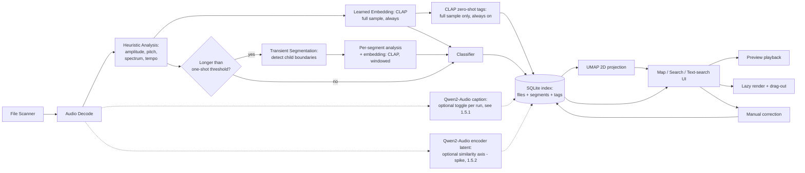

# Sample Library Search & Mapping Tool — Project Documentation

## Sample proposal #2

Status: **Draft for review**, builds directly on [Sample proposal #1](samples001.md). This document only covers what's new or changed — problem framing, prior art, base tech stack, and Bitwig integration mechanics carry over unchanged from Proposal #1 and aren't repeated here.

---

## 0. What's new in this proposal

Two deltas, both from your feedback after reading Proposal #1:

1. **Hybrid similarity + audio-to-text tagging.** Similarity should be explicitly grounded in **amplitude, pitch, timbre, and spectrum** (your words) — not just a black-box learned embedding — and layered with an audio-to-text capability so you can search/tag by description, not just by "sounds like this other file." You flagged `bosonai/higgs-audio-v2-tokenizer` as a candidate worth researching (later withdrawn in favor of Qwen2-Audio — see §1.5).
2. **Recognizing one-shots embedded inside longer samples.** Your 1b/1c categories (multi-transient hit sounds, long drum/music loops) contain individually usable hits that Sononym-style tools treat as one opaque file. This proposal makes those inner hits first-class, independently searchable, independently draggable objects — without turning the app into a slicer/instrument-builder.

Everything else — SQLite storage, PySide6 desktop shell, UMAP map, native drag-out to Bitwig, the two-facet taxonomy — stands as designed in Proposal #1.

---

## 1. Hybrid Similarity Model

### 1.1 Why hybrid

Proposal #1 leaned on a single learned embedding (CLAP) for both the map layout and "find similar." That's a good default, but a learned embedding is a black box — it won't tell you *why* two sounds are similar, and it's not reliably sensitive to things like exact pitch or loudness (two CLAP-similar sounds can be a fifth apart in pitch; two very differently-voiced sounds can land close together if their broad character matches). Sononym's actual pitch is closer to classic, interpretable descriptors — which is exactly what you named: amplitude, pitch, timbre, spectrum. The fix is to run both, side by side, and let them cover each other's blind spots.

### 1.2 Descriptor layer — amplitude, pitch, timbre, spectrum

| Your axis | Concrete descriptors | Notes |
|---|---|---|
| **Amplitude** | Peak level, RMS level, crest factor, attack time (onset→peak), decay time (peak→‑20 dB) | Cheap, deterministic, also doubles as a signal for structural type (fast attack = percussive-reading, even on long-tail sounds) |
| **Pitch** | Fundamental frequency via `librosa.pyin`, harmonicity/voicing confidence | Only computed when the harmonic/percussive ratio (already part of Prop #1's heuristics) indicates tonal content — meaningless on pure noise/transients, so it's skipped rather than forced there |
| **Timbre** | MFCCs (mean + variance across the sample), spectral contrast | The classic "does this feel like the same instrument/material" descriptor set |
| **Spectrum** | Spectral centroid, bandwidth, rolloff, flatness | Captures brightness/noisiness independent of pitch |

All of the above stay within `librosa` — no new dependency beyond what Proposal #1 already specifies.

### 1.3 Learned embedding layer

CLAP stays as designed in Proposal #1 §6 — it remains the "does this sound conceptually alike" catch-all that descriptor math misses (two sounds can have similar MFCCs and still feel unrelated, and vice versa). No change here, other than promoting it from "the similarity model" to "one half of the similarity model."

### 1.4 Combining them

Normalize each descriptor group and the embedding vector independently, then blend into one similarity space used for both map layout and "find similar." Conceptually: at one extreme, matches are driven almost entirely by amplitude/pitch/timbre/spectrum — good for "find me another kick with this exact snap and decay." At the other, matches lean on the learned embedding — good for "find me something with the same vibe, even if it's a totally different sound source." This directly answers the ask (amplitude/pitch/timbre/spectrum-based comparison) while keeping the learned-embedding upside from Proposal #1, instead of picking one or the other. §5.4 details how this actually surfaces in the UI — a full per-axis control panel, not just a single slider, since (per your framing) the "comparing factor" needs to be genuinely user-settable rather than a single fixed dial.

### 1.5 Audio-to-text tagging

**Good news first:** CLAP was already chosen in Proposal #1 specifically because, unlike a pure audio-similarity embedding, it's trained jointly with text — so "search by description" is largely already bought by that decision, not a separate system to build from scratch. What's new here is making it a first-class feature, and — per your steer — running it alongside a dedicated audio captioning model rather than treating this as a pick-one bake-off.

#### 1.5.1 Two models, two jobs

Rather than choosing between CLAP and a captioning model, run both — they're not actually competing for the same job:

| Signal | Source | Job | Cost profile |
|---|---|---|---|
| Zero-shot labels + retrieval embedding | **CLAP** | Fast text↔audio matching, the default text-search box, cheap fallback tags | Cheap, CPU-viable, already in the stack |
| Natural-language caption | **Qwen2-Audio** | A real descriptive sentence per sound ("a bright metallic percussion hit with a fast decay, slight ring-out") — richer tag/search corpus than a fixed label set can give you | Heavier, **optional/toggle-gated** — CPU-viable in principle, real per-file cost still unmeasured on your hardware; GPU would help but isn't required to try it |

CLAP stays the fast/cheap default for every sample, always on. **Qwen2-Audio's caption is optional, toggled per Recompute-attributes run (§5.6), not a committed unconditional step** — you're on CPU only right now, and while a single Qwen2-Audio caption pass is genuinely cheaper than a diffusion image model's many-step denoising loop, "cheaper than image generation" and "fast on CPU" aren't the same claim: a multi-billion-parameter model still costs real seconds-to-tens-of-seconds per file on CPU alone, and that's worth measuring on your actual hardware rather than assuming. Practical path: run it on a small batch first (Phase 3.5, §7), see the real per-file time, then decide how broadly to enable it — worth knowing a quantized build (e.g. a GGUF/int4 variant via a CPU-oriented runtime) may be the difference between "fine overnight" and "impractical," if full-precision CPU inference turns out too slow.

`bosonai/higgs-audio-v2-tokenizer` is dropped from consideration here per your note — its training objective (generative TTS/voice tokenization, not text-audio retrieval) made it a poor fit for this job specifically, which is exactly the kind of scrutiny that turned up the more interesting question below.

#### 1.5.2 A third possibility: Qwen2-Audio's latent space as a similarity axis

Your instinct here is worth taking seriously, and I'd go further than "maybe" on the reasoning: Qwen2-Audio's audio encoder is a Whisper-style network trained heavily on speech/ASR-oriented data. That's a very different training diet from CLAP's (environmental sounds, music, captioned audio events) — which suggests its internal representations may capture speech/vocal nuance (speaker timbre, prosody, phonetic content) that CLAP was never optimized to distinguish. If that holds up, it's a genuinely useful *complementary* axis, not a redundant one: CLAP as the general-purpose axis across all four of your categories, Qwen2-Audio's encoder latent as an additional "vocal/semantic likeness" axis — most valuable when browsing Vocal-classified content, but exposed as a selectable axis regardless (see §5.5 for how this surfaces as a control).

This needs a spike before it's trusted, for a concrete reason: CLAP's embedding is a documented, intended output built for exactly this kind of comparison; Qwen2-Audio's encoder was never designed to be read out this way, so there's real work in figuring out *how* to extract a usable vector from it. My suggested approach:

- **Extraction**: mean-pool (or attention-pool) Qwen2-Audio's audio-encoder hidden states before they reach the language-model decoder — the same general trick used elsewhere to repurpose an audio-language model's encoder as a plain embedding extractor, independent of its text output. Expect to try more than one pooling strategy/layer; there's no single documented "correct" one the way there is for CLAP.
- **Evaluation set**: hand-pick a small set of known-similar and known-dissimilar pairs across your categories — e.g. two takes of the same spoken phrase, two performances by the same voice, a drum hit against its layered variant, two unrelated foley sounds. Compare nearest-neighbor rankings from CLAP against rankings from the pooled Qwen2-Audio vector on this set: do they agree, or do they surface different-but-still-sensible neighbors (the interesting outcome), or just noise (the negative result)?
- **Piggyback, don't duplicate**: this rides on the same Phase 3.5 spike and the same ~100–200 sample subset already proposed below for captioning validation — no need for a second, separate spike.

Treat a positive result as "worth adding as an optional third axis," not as a foregone conclusion — this is the one piece of §1.5 that's genuinely a research question rather than a design decision already made.

**Proposed spike scope** (small, timeboxed, before committing engineering time to either piece): validate Qwen2-Audio captioning quality and per-file cost on your actual hardware, and run the latent-similarity evaluation above. Deliverable: a short written recommendation, confirmation of per-file inference time/VRAM footprint for budgeting Phase 7's scan-time expectations, and a verdict on whether the latent axis earns a place in the UI's similarity controls.

**Where this shows up in the product:**
- A free-text search box ("metallic clang," "warm analog pad") matched against CLAP's text-capable embedding.
- Auto-suggested, editable tag chips per sample, drawing on both CLAP's zero-shot labels and Qwen2-Audio's captions.
- Optional **semantic cluster labels** on the map — labeling a dense region with its most common auto-tag (e.g. "808 subs," "vinyl foley"), which turns the map from "a cloud of dots" into something skimmable at a glance.
- If §1.5.2's spike pans out: a selectable "vocal/semantic likeness" similarity axis, alongside the others — see §5.5.

---

## 2. Transient Segmentation — Recognizing One-Shots Inside Longer Samples

### 2.1 The gap this closes

Sononym-style tools (and Proposal #1 as originally scoped) treat every file as one atomic, opaque unit. But your own taxonomy already implies otherwise: a 1c drum loop is *made of* individual hits, and a lot of 1b foley/synth multi-hits are really several usable one-shots recorded into a single take (e.g. four footstep foley hits in one file). Right now those hits are invisible to search — you'd have to already know a loop has a great snare in it, open it, and manually chop it. This feature makes those inner hits discoverable the same way a real standalone one-shot file is.

### 2.2 Detection approach

Runs as an added stage after the existing heuristic analysis (Proposal #1 §5 step 2), for anything **not already a clean single-hit one-shot**. Fully configurable from the Recompute tab (§5.6), not hard-coded:

- **Two onset-detection profiles**, chosen by the sample's already-computed structural type — this governs *how onsets are detected*:
  - *Tight/percussive* (high-frequency-content or complex-domain onset detection) for **Rhythmic/Loop** content — this is the classic breakbeat-chop case, tuned to find each discrete drum hit cleanly.
  - *Loose/gesture* (energy-based, with a minimum inter-onset interval and merging of onsets that are too close together to be separate hits) for **multi-transient hit** content — tuned to avoid shredding one continuous foley/synth gesture into meaningless micro-fragments.
- **Transient sensitivity** (§5.6): a configurable threshold for how strong a transient must be to count as a candidate boundary at all — expect a tuning pass against your actual library rather than a one-shot correct value (§8 risk #1).
- **Segment boundaries** — *how a segment ends* once it starts, orthogonal to the onset-detection profile above — one of two configurable modes: **transient-to-transient** (stop at the next detected onset, clean breakbeat-chop style) or **transient-to-fixed-length** (extend a fixed duration from the onset regardless of further transients inside that window, for gestures — e.g. a rapid-fire foley cluster — that should stay whole rather than get chopped at every internal sub-transient).
- **Length constraints, resolved** — apply to **automatic detection only** (§2.3): a configurable min and max segment length (seconds or % of parent duration, §5.6). A candidate shorter than the minimum is **dropped** — treated as noise, not merged or padded. A candidate that would exceed the maximum (typically transient-to-transient mode hitting an unusually large gap before the next onset) is **truncated at the max** rather than dropped entirely — an obvious transient still yields a (truncated) segment instead of no segment at all.
- **Per-sample cap, resolved** — also **automatic detection only** (§2.3): at most **5 segments per sample** (adjustable on the Recompute tab). When more candidates pass the sensitivity/length checks than the cap allows, the **strongest transients win** — the N candidates with the highest onset strength are kept, regardless of where they fall in the sample. When this cap actually binds (i.e. more valid candidates existed than the cap allowed), the sample is flagged with a visible warning (§4's `segments_capped`/`effective_sensitivity` fields) — framed as *"sensitivity was effectively raised for this file to fit within the cap"* rather than a silent drop, so you know to look closer (raise the cap, or add a missed hit manually per §2.3, which bypasses the cap entirely) if a candidate that mattered got squeezed out.
- This reuses `librosa`'s onset-detection functions already in the stack — no new core dependency, mainly new logic.

### 2.3 Segments as indexes on a sample, not separate items

Revised per your steer: a segment is **not** a peer entity to a real file — it's a lightweight index record (a start/end marker pair) attached to its parent sample, not a row that shows up in the map/list the way a real file does. Concretely (schema in §4):

- A segment still gets its **own embedding**, computed on just its windowed slice using the same hybrid model from §1 — that's what actually needs to be per-segment, since it's what would place a buried snare near other snares in similarity terms even though it lives inside a loop file. It still gets its own lightweight classification (structural type fixed to "One-shot," content class copied from the parent as a strong prior).
- It does **not** get its own caption/tags (§1.5.1) — those stay inherited from the parent, for the same cost-control reason as before (captioning cost scales with file count, not segment count).
- It does **not** appear as its own point on the map or its own row in the List view by default. Per your call on how this should surface: **when a search or similarity query matches a segment better than it matches the segment's own parent, the segment surfaces as a labeled sub-hit** — an indented "hit within `break_140bpm.wav` @ 1.2s" row nested under the parent in List, and a badge on the parent's existing map point (§5.3–5.4). Outside of a match like that, a sample's segments live in that sample's own drill-down view only.

**Manual segments.** Beyond automatic detection, you can create or adjust a segment by hand — drag start/end markers on the header's waveform preview (§5.2) and hit **Save segment**. Per your call, this is deliberate and protected: nothing is written until you explicitly save, and once saved (`detection_method='manual'`, `is_user_confirmed=true`) it's excluded from being altered by a later automatic Recompute-attributes pass, mirroring how manual classification corrections already work (`K`, §3). **Resolved: none of the automatic constraints apply to a manual segment** — not the max-segments-per-sample cap (§2.2), not the min/max length rule. Dragging a marker is an explicit, deliberate act; it isn't second-guessed against the heuristics that exist purely to filter out *automatically-detected* noise. Practically: you can always add a 6th (or a 1-frame, or a whole-file-length) segment by hand regardless of what auto-detection already found or would otherwise allow, and it never evicts or competes with anything else. This protection is against the *pipeline* only — a **Delete segment** action (header, §5.2) lets you remove a manual (or automatic) segment yourself at any time; that's a deliberate user action, not the kind of silent overwrite the protection guards against.

### 2.4 Lazy rendering, not eager slicing

Pre-rendering every candidate segment as its own WAV file for the whole library upfront would multiply file count many times over for no immediate benefit, and blow up scan time and cache size. Instead:

- **Detection and embedding happen in-memory** during analysis — boundaries and similarity vectors are computed and indexed for every candidate segment, so everything is searchable/mappable immediately, at negligible extra disk cost.
- **Audio is only physically rendered to a small cached WAV (with a short fade-out to avoid clicks) the first time you preview or drag out that specific segment.** The cache is disposable and LRU-evictable — a rendered segment is trivially regenerable from its parent file + offsets, so it never needs to be treated as precious.
- Drag-out then works exactly as designed in Proposal #1 §9: the app hands the OS a real file path, just with a just-in-time render step in front of it the first time.

### 2.5 Scope boundary (repeating deliberately)

This is transient detection **for findability**, not a slicing/re-sequencing instrument. No pad grid, no drag-to-reorder, no batch "export sliced kit" builder. If you later want to build a persistent sliced instrument from a loop, Bitwig's own Sampler slicing already does that well — this tool's job stops at "here's a clean, individually auditionable, individually searchable, drag-outable one-shot that happens to live inside a bigger file." Keeping that line matches your original brief: search engine, not sampler.

---

## 3. Updated Architecture



Two things this redraw fixes/clarifies versus the first pass: **CLAP embedding now runs unconditionally on the full sample** regardless of whether it also gets segmented (the "longer than one-shot threshold?" branch only ever gated *segmentation*, never embedding — the earlier diagram accidentally implied otherwise), and **each segment gets its own independent embedding too** (`C2`), computed on its own windowed audio, not inherited from the parent.

Worth being explicit about the execution guarantee this implies, since it's easy to misread the "no" branch as skipping something: **`D` depends only on `C`, never on `S`.** By the time `S` resolves — either way — `D` has already run to completion. The "no" branch doesn't wait for `D`, and it doesn't need to: `D`'s output is already sitting in `F` regardless of which branch gets taken, so both `E` and `X` always have it available. Nothing about segmentation gates, delays, or invalidates the full-sample embedding.

Audio-to-text tagging is now split into three nodes with different commitment levels, not one: `X` (CLAP zero-shot labels, fed from `D`'s embedding) is solid — always runs, cheap, unconditional, same as before. `X1` (Qwen2-Audio's caption, fed from `B`'s raw audio since captioning needs the actual waveform, not CLAP's vector) is now dashed — **optional, toggled per Recompute-attributes run** (§5.6), reflecting that you're CPU-only and its real per-file cost isn't measured yet (§1.5.1). `X2` (Qwen2-Audio's encoder latent as a candidate similarity axis) stays dashed for a different reason — it's an unconfirmed research question (§1.5.2), not a toggle-able feature yet. Both dashed paths route to `F` only when actually run; `X`'s output is the only one of the three you can always count on.

### Process Reference

Every node in the diagram, in execution order, with what it does and its concrete inputs/outputs. Field names refer to the schema in §4 below (and Proposal #1 §7 for anything not restated there).

**A — File Scanner**
- Task: Recursively walk `D:\_soundPacks`, identify audio files, filter/log unsupported formats (Kontakt patches, REX, etc. — skipped, not silently dropped), and diff against the last run so only new/changed files get reprocessed.
- Inputs: Root folder path; prior scan state (`file_hash`, `last_scanned_at` from existing `samples` rows).
- Outputs: A worklist of files to (re)process, plus a new skeleton `samples` row per new file (`filepath`, `filename`, `folder`, `file_hash`, `added_at`).

**B — Audio Decode**
- Task: Load a file's audio into memory in a normalized form (consistent sample rate/channel handling) so every later step works on the same representation regardless of the source format/bit depth.
- Inputs: `filepath` (from A).
- Outputs: An in-memory decoded waveform buffer; `duration_s`, `sample_rate`, `channels` written to the `samples` row. Decode failures are logged back to A's skip path rather than aborting the run.

**C — Heuristic Analysis**
- Task: Compute the deterministic descriptor set behind amplitude/pitch/timbre/spectrum similarity (§1.2), plus the tempo/onset/loop-ness facts that drive structural typing — including reading embedded WAV `acid`/`smpl` metadata when present (Proposal #1 §5).
- Inputs: Decoded waveform buffer + `duration_s`/`sample_rate` (from B).
- Outputs: The `analysis` row — `tempo_bpm`, `tempo_confidence`, `onset_count`, `is_loop`, `key`, `harmonic_ratio`, `embedded_metadata_json`, `peak_db`, `rms_db`, `crest_factor`, `attack_ms`, `decay_ms`, `f0_hz`, `pitch_confidence`, `mfcc_mean`, `mfcc_var`, `spectral_contrast`, `spectral_centroid`, `spectral_bandwidth`, `spectral_rolloff`, `spectral_flatness`. Also supplies the `duration`/`onset_count` signal decision `S` reads.

**D — Learned Embedding: CLAP (full sample, always)**
- Task: Produce the general-purpose semantic/timbral similarity vector for the whole sample — the "conceptual" half of the blended similarity space (§1.4), and the representation node `X` (tagging) is built from.
- Inputs: Decoded waveform buffer (from B), full sample, unwindowed.
- Outputs: An `embedding` row (`sample_id`, `model_name='clap'`, `vector`) for the parent sample.

**S — Decision: longer than one-shot threshold?**
- Task: A cheap gate deciding whether this sample is already a clean single hit (skip segmentation) or a candidate for containing multiple discoverable hits (run segmentation).
- Inputs: `duration_s` (from B), `onset_count` (from C).
- Outputs: No data written — purely routes the pipeline to `T` or straight to `E`. **Does not gate `D`:** the full-sample embedding runs independently off `C` and has already completed by the time this decision resolves, whichever way it goes.

**T — Transient Segmentation**
- Task: Detect candidate segment boundaries per §2.2 — onset-detection profile chosen by the sample's structural signal from `C`, transient-sensitivity threshold and boundary mode (transient-to-transient/fixed-length) from the Recompute-tab settings (§5.6), length constraints applied (drop-short/truncate-long), and the strongest-N-survive rule applied if candidates exceed the per-sample cap.
- Inputs: Decoded waveform buffer (from B); onset/tempo signals (from C); the configured sensitivity/length/mode/cap settings.
- Outputs: One new `segments` row per surviving candidate (`sample_id` set to the parent, `start_ms`/`end_ms` set, `detection_method='auto'`, `cache_path` left null — no audio rendered yet, per §2.4). If the cap actually binds, also updates the parent `samples` row's `segment_candidates_found`, `segments_capped`, `effective_sensitivity` fields (§4) so the UI can surface the "capped" warning from §2.2.

**C2 — Per-segment analysis + embedding (CLAP, windowed)**
- Task: Re-run the same descriptor extraction (§1.2) and CLAP embedding as `C`/`D`, scoped to one segment's `start_ms:end_ms` window, computed in-memory from the parent's already-decoded buffer — no disk I/O.
- Inputs: Decoded waveform buffer (from B), sliced to the segment's window; the `segments` row (from T).
- Outputs: `segment_analysis` and `segment_embedding` rows keyed to the segment's id (§4) — same descriptor/vector shape as `C`/`D`'s outputs, just windowed and fully independent of the parent's, stored in their own tables rather than reusing `analysis`/`embedding`.

**X — CLAP zero-shot tagging (full sample only, always on)**
- Task: Generate zero-shot labels via CLAP by comparing the sample's embedding against a set of text prompts. Scoped to full/parent samples only — segments inherit rather than recompute (§2.3).
- Inputs: The full-sample `embedding` (from D).
- Outputs: `text_tags` row(s) (`sample_id`, `tag_or_caption`, `source_model='clap-zeroshot'`, `is_user_confirmed=false`).

**X1 — Qwen2-Audio captioning (full sample only, optional toggle)**
- Task: Generate a natural-language caption via Qwen2-Audio (§1.5.1). Unlike `X`, this is **not unconditional** — it runs only when enabled for a given Recompute-attributes pass (§5.6), since its real per-file cost on CPU-only hardware isn't established yet.
- Inputs: Decoded waveform buffer (from B) — needs raw audio, not CLAP's vector, since it's a separate model.
- Outputs, when enabled: a `text_tags` row (`sample_id`, `tag_or_caption`, `source_model='qwen2audio-caption'`, `is_user_confirmed=false`). When disabled, no row — samples simply carry CLAP tags only.

**X2 — Qwen2-Audio encoder latent (spike, optional)**
- Task: Extract a pooled representation from Qwen2-Audio's audio encoder and test whether it's a useful additional similarity axis, per §1.5.2. Not a committed pipeline stage — dashed in the diagram on purpose.
- Inputs: Decoded waveform buffer (from B), full sample.
- Outputs, if the spike confirms it's worth keeping: an additional `embedding` row (`sample_id`, `model_name='qwen2audio-latent'`, `vector`) — reuses the existing `embedding` table shape, no schema change needed. Until then: a spike report, no persisted output.

**E — Classifier**
- Task: Assign both taxonomy facets — content class and structural type (Proposal #1 §4) — to every sample, and a lighter version to every segment (structural type is effectively fixed to "One-shot"; content class is copied from the parent as a strong prior, per §2.3).
- Inputs: `analysis`/`embedding` rows for a sample, or `segment_analysis`/`segment_embedding` rows for a segment.
- Outputs: A `classification` row for a sample, or a `segment_classification` row for a segment (§4) — `content_class`, `structural_type`, `confidence`, `is_user_confirmed=false`, `classified_at`. Low-confidence results are flagged for review rather than committed silently.

**F — SQLite index**
- Task: The persistent store tying every stage's output together — a landing point, not a compute step.
- Inputs: Rows from `samples` (A/B/T's cap fields), `segments` (T), `analysis`/`embedding`/`classification` (C/D/E, samples only), `segment_analysis`/`segment_embedding`/`segment_classification` (C2/E, segments only), `text_tags` (X, and X1 when enabled — samples only).
- Outputs: The queryable database everything from `G` onward reads from; also the write-back target for `K`.

**G — UMAP 2D projection**
- Task: Compress the blended similarity space (§1.4) into 2D map coordinates. Samples get real plotted points; segments get coordinates too (used only for the parent-badge/nested-sub-hit display in §2.3, never their own independent point). Runs one of two ways depending on the Recompute-tab scope (§5.6): **anchored-only** uses the existing fitted UMAP model's `.transform()` to place just the anchor into the current layout (cheap, doesn't move anyone else); **whole-library** re-fits UMAP from scratch over every point (expensive, moves everyone).
- Inputs: `analysis`/`embedding` for samples, `segment_analysis`/`segment_embedding` for segments (from F); the previously-fitted UMAP model, for the anchored-only path.
- Outputs: `map_x`, `map_y` written back onto `embedding` rows (samples) and `segment_embedding` rows (segments) — just the anchor's under anchored-only scope, everyone's under whole-library scope. Recomputed on demand via the Recompute tab (§5.6), never automatically.

**H — Map / Search / Text-search UI**
- Task: The interactive surface — 2D map (colored/filtered by taxonomy), list/grid view, filter panel, free-text search, "find similar."
- Inputs: Everything in F, plus live user input (filters, search text, a selected sample for similarity lookup).
- Outputs: Rendered/filtered view state; a selected sample/segment handed to `I` or `J`; edits handed to `K`.

**I — Preview playback**
- Task: Play a selected sample or segment so it can be auditioned before use.
- Inputs: For a real file, its `filepath` directly. For a segment, parent `filepath` + `start_ms`/`end_ms` (may trigger `J`'s lazy render, or play directly from the decoded buffer with in/out points if the UI supports that without rendering — an open implementation choice, not yet settled).
- Outputs: Audio through the system output device; no database write.

**J — Lazy render + drag-out**
- Task: On first preview/drag of a segment, render the trimmed, faded WAV to the on-disk cache (§2.4); then hand the OS a real file path — the original file for a real sample, or the cached render for a segment — for native drag-and-drop into Bitwig/Explorer.
- Inputs: Target sample or segment id; its `filepath` (sample) or parent `filepath` + `start_ms`/`end_ms` (segment); existing `cache_path` on the `segments` row if already rendered.
- Outputs: A cache WAV file + updated `cache_path`/`cache_rendered_at` on the `segments` row (first use only); a native OS drag/file event on every use.

**K — Manual correction**
- Task: Let you override a sample's/segment's content class, structural type, or tags when the pipeline got it wrong — **or** manually create/adjust a segment's start/end markers from the header (§2.3, §5.2).
- Inputs: A user edit action (new classification/tag value, or new/adjusted marker positions) + target sample or segment id.
- Outputs: For classification/tags — an updated `classification`/`text_tags` row with `is_user_confirmed=true`. For markers — a new or updated `segments` row with `detection_method='manual'`, `is_user_confirmed=true`, committed only on an explicit "Save segment" action, not live while dragging. Either way, written to `F` and excluded from being overwritten by a later automatic re-run of `E`/`T` (Proposal #1 §8's correction workflow, extended to segments).

---

## 4. Updated Data Model (delta from Proposal #1 §7)

Revised from the first draft: segments are no longer self-referential `samples` rows. Per your steer (§2.3), they're lighter index records in their own tables, parallel to (not reusing) the sample-level ones:

```
samples                                             -- real files only, again
  id, filepath, file_hash, filename, folder, duration_s,
  sample_rate, channels, added_at, last_scanned_at,
  segment_candidates_found (nullable int),          -- NEW: raw candidate count before the cap
  segments_capped (bool, default false),            -- NEW: true if candidates_found > cap
  effective_sensitivity (nullable)                  -- NEW: the threshold that would naturally yield exactly the kept count, for the "capped" warning (§2.2)

analysis                                            -- samples only, as in Proposal #1 + new descriptors
  sample_id (FK), tempo_bpm, tempo_confidence, onset_count,
  is_loop, key, harmonic_ratio, embedded_metadata_json,
  peak_db, rms_db, crest_factor, attack_ms, decay_ms,   -- NEW: amplitude descriptors
  f0_hz (nullable), pitch_confidence (nullable),        -- NEW: pitch descriptors
  mfcc_mean, mfcc_var, spectral_contrast,               -- NEW: timbre descriptors
  spectral_centroid, spectral_bandwidth,
  spectral_rolloff, spectral_flatness                   -- NEW: spectrum descriptors

embedding                                           -- samples only
  sample_id (FK), model_name, vector (blob), map_x, map_y

text_tags                                           -- samples only — segments inherit, never get their own row (§2.3)
  sample_id (FK), tag_or_caption, source_model,
  is_user_confirmed (bool)

segments                                            -- NEW: the index records themselves
  id, sample_id (FK -> samples.id, NOT NULL — always a real parent file),
  start_ms, end_ms,
  detection_method ('auto' | 'manual'),
  is_user_confirmed (bool, default false),          -- true once manually saved (§2.3) — protects from auto-recompute overwrite
  cache_path (nullable), cache_rendered_at (nullable)  -- lazily-rendered audio (§2.4)

segment_analysis                                    -- NEW: mirrors `analysis`'s descriptor set, segment-scoped
  segment_id (FK), tempo_bpm, onset_count, harmonic_ratio,
  peak_db, rms_db, crest_factor, attack_ms, decay_ms,
  f0_hz, pitch_confidence, mfcc_mean, mfcc_var, spectral_contrast,
  spectral_centroid, spectral_bandwidth, spectral_rolloff, spectral_flatness
  -- is_loop/key/embedded_metadata_json omitted — don't apply to a segment

segment_embedding                                   -- NEW: mirrors `embedding`
  segment_id (FK), model_name, vector (blob), map_x, map_y
  -- map_x/map_y kept even though segments aren't independently plotted (§2.3) — used for the parent-badge/nested-hit display

segment_classification                              -- NEW: mirrors `classification`, minimal
  segment_id (FK), content_class (copied from parent at detection time),
  structural_type (= 'one-shot', effectively fixed), confidence, is_user_confirmed

classification, tags, sample_tags, crates, crate_samples
  -- unchanged from Proposal #1, samples only
```

Trade-off worth naming: this is four new tables instead of one self-referential column set, which is more schema surface than the original design. The payoff is that it matches your mental model directly — a `segments` row reads unambiguously as "an index into a sample," never as "a sample masquerading as another sample" — and every sample-facing query (map, list, filters) simply never needs to know segments exist at all, since they're not in the tables those queries touch.

---

## 5. UI Design

You named the two reference points precisely: Atlas 2's spatial map and Sononym's sortable list aren't actually competing ideas — they're two views over the same underlying, filtered, ranked dataset. The piece neither of them exposes the way you want is the **comparing factor**: what "similar" means right now is a choice, not a fixed property of the data, since every sample has a *different* similarity to every other sample depending on which axis you're asking about.

Revised from the first draft per your feedback: preview/anchor/drag-out moved into the header (was a bottom bar), filters and the comparing-factor controls merged into one panel (was two, left and right), that panel now has an explicit Attributes/Recompute tab split, presets are dropped for now, and — the biggest behavioral change — **nothing recomputes automatically, anywhere.** No left panel; map/list gets the full remaining width.

### 5.1 Layout overview

```
┌──────────────────────────────────────────────────────────────────────────┐
│  Crate                                              [ Map ]     [ List ]  │  ← header row 1: view switch
├────────────────────────────────────────────────────────────────────────── │
│ ▶ break_140bpm.wav @ 1.2s  [waveform▂▃▅▇▅▃▂...]   [⚓ Anchor]  [Drag ↗]   │  ← header row 2: preview/anchor/drag
├──────────────────────────────────────────────────────────────┬───────────┤
│                                                                │ Attributes│  ← right panel, 2 tabs
│                                                                │ Recompute │
│                     map canvas / list table                   ├───────────┤
│                     (full remaining width —                   │           │
│                      no left panel)                           │  (active  │
│                                                                │   tab's   │
│                                                                │  content, │
│                                                                │  §5.5/5.6)│
│                                                                │           │
└────────────────────────────────────────────────────────────────┴───────────┘
```

Header = the two things you use constantly (§5.2). Center = map/list, sharing one filtered/ranked dataset and one selection state regardless of which view is active. Right = a single tabbed panel folding what used to be two side panels into one (§5.5–5.6).

### 5.2 Header — preview, anchor, drag-out

Elevated from a bottom bar in the first draft, since these are the most-used actions in the whole app:

- **View switch** (`Map` / `List`) — top-right of the header, always visible regardless of scroll/zoom state in the main view.
- **Preview**: whatever's currently selected (from either view) loads here — waveform, play/stop — without committing to anything else.
- **⚓ Anchor**: pins the currently-previewed sample/segment as the active comparison reference. This is the one action that turns the Attributes tab's range controls from inert into live-against-something (§5.5) and is a prerequisite for a Recompute-ranking pass (§5.6) — nothing else in the UI needs an anchor to function.
- **Drag ↗**: native OS drag straight onto a Bitwig track/arranger/device slot (Proposal #1 §9). For a not-yet-cached segment this transparently triggers `J`'s lazy render first (§2.4) — no separate export step.
- **Manual start/end markers**: the waveform preview carries draggable in/out markers on whatever's currently loaded. Dragging them stages a change only — nothing is written until you press **Save segment**, at which point it's committed as `detection_method='manual'`, `is_user_confirmed=true` (§2.3, §4) and protected from later automatic Recompute-attributes passes. Dragging the markers of an already-selected segment edits it in place; dragging fresh markers on a sample with none selected defines a brand-new manual segment on it.

### 5.3 Map view (Atlas 2-style)

- One point per **sample** (real files only — §2.3 means segments never get their own point), positioned by whichever map layout was last explicitly computed (§5.6 — never automatic), colored by content class, sized/shaped by structural type.
- Clicking a point previews it (§5.2). If a sample is anchored and a ranking has been computed (§5.6), its nearest neighbors under that ranking are highlighted as a halo — this is a display of the *last computed* ranking, not a live recalculation as you look around.
- **Segment match badge**: if a search/similarity query's best match within a sample is actually one of its segments rather than the sample itself, that sample's point gets a small badge indicating "a hit inside this file matched, not the file as a whole" — clicking through shows which segment and lets you preview/drag *it* specifically (§2.3). No separate dots, no decluttering problem — there was only ever one point per real file to begin with.

### 5.4 List view (Sononym-style)

- A conventional sortable/filterable table of **samples** — content class, structural type, duration, tempo, key, tags. Segments are not independent rows here either, by default (§2.3).
- Once a sample is anchored (§5.2) **and** you've run **Recompute ranking** from the Recompute tab (§5.6), a **Similarity** column appears, ranking every row by distance to the anchor under the weights that were active at that moment. It does not change again until you recompute — nudging a weight slider afterward changes nothing in the list until you explicitly ask it to.
- **Nested sub-hit rows**: when that ranking finds a sample whose best-matching content is actually one of its segments rather than the sample as a whole, the segment appears as an indented row directly under its parent — labeled "hit within `<parent>` @ 1.2s" — rather than the parent's own (weaker) match being the only thing shown. This is the concrete mechanism behind §2.3's promise that segments stay findable without cluttering the default view: they only ever appear when they're specifically the reason something matched.
- Without an anchor, or before the first recompute, List is just the normal sortable browse table of samples, no segments visible anywhere.

### 5.5 Attributes tab — merged filters + comparing-factor weights

Filters and "compare by" are now one panel, top to bottom:

**1. Weight bars** — one per similarity signal: **Amplitude, Pitch, Timbre, Spectrum** (§1.2), **Conceptual** (CLAP, §1.3), and — conditionally, only if §1.5.2's spike earns it a place — **Vocal-semantic** (Qwen2-Audio's latent). These set the blend used the *next time* you run Recompute ranking or Recompute map layout (§5.6) — moving them doesn't recompute anything by itself. No presets for now, per your steer — plain adjustable bars; presets are a reasonable later addition once there's real usage to know what's worth presetting.

**2. Text search** — free-text box matched against CLAP's text embedding (§1.5), filters the visible set immediately (this is plain filtering over already-indexed data, not a model call, so it's fine for it to be instant).

**3. Filter criteria** — everything that narrows what's visible, all instant/local filtering over already-stored values, no recompute involved:

| Filter | Type | Needs an anchor? |
|---|---|---|
| Content class (Rhythmic/Melodic/Vocal/Other) | Checkbox | No |
| Structural type (One-shot/Multi-hit/Loop) | Checkbox | No |
| Duration, Tempo | Absolute range | No |
| Per-axis range — Amplitude/Pitch/Timbre/Spectrum/Conceptual/Vocal-semantic | Distance-from-anchor range | **Yes** |

The per-axis ranges are what makes "anchor a sample and constrain each attribute around it" possible: hitting ⚓ Anchor (§5.2) computes every candidate's distance to the anchor on each axis right then — a one-off, on-demand calculation over vectors already sitting in the index (cheap; it's arithmetic, not model inference), not a continuous background process. Once that's done, each axis gets a range bar showing where everything falls (0 = identical to the anchor, increasing = more different), and dragging its threshold hides anything beyond that cutoff — instantly, since it's just filtering the distances just computed, nothing to wait on. Before anything is anchored, these six rows are visibly inactive rather than hidden, so it's clear anchoring is what unlocks them.

Weight (tier: "how much this axis matters for ranking/layout") and range (tier: "hard cutoff on this axis, relative to the anchor") are deliberately separate controls on the same axis — a low-weight axis can still hard-exclude outliers via its range, and a tightly-ranged axis can still be weighted low in the blend.

### 5.6 Recompute tab — on-demand only, nothing automatic

Stated as policy, not just performance advice: **no map layout, ranking, or attribute/analysis recomputation ever runs automatically** — not on a slider change, not on a debounce timer, not in the background. Everything here is an explicit button press.

**Every applicable action now offers the same two-way scope choice**, set right before running it:
- **⚓ Anchored sample only** — runs just against whatever's currently pinned (§5.2). This is the fast path: tweak a setting, run it against the one sample in front of you, check the result, adjust, repeat — without paying the cost of a full pass on every iteration.
- **📚 Whole library** — runs across everything.

The configuration knobs below (weights, segmentation settings, the Qwen2-Audio toggle) are the same regardless of which scope you pick — scope only decides *how many samples* an action touches, not *what it does to them*:

| Action | What it does | Scope options | Needs an anchor? |
|---|---|---|---|
| **Recompute ranking** | Re-sorts List's Similarity column by distance to the anchor, under the weights active right now (§5.5) | Whole library, or visible/filtered set only — see note below on why "anchored only" isn't offered here | Yes |
| **Recompute map layout** | Re-runs the 2D projection (§`G`) over the current weighted blend | **Anchored sample only** — projects just the anchor into the *existing* layout via UMAP's out-of-sample transform, without moving anyone else, so it's cheap; **Whole library** — a full UMAP re-fit, moves every point, expensive | No |
| **Recompute attributes** | Re-runs analysis/embedding/classification/segmentation (§3's pipeline) | **Anchored sample only**, or **Whole library** (with a sub-toggle: new/changed files only, or force a full re-index) | No |

Why **Recompute ranking** doesn't get an "anchored sample only" option: ranking is *already* defined relative to the anchor by construction — there's nothing to rank if the candidate pool is just the anchor itself. Its scope question is a different axis (which candidates get ranked against the anchor, not how many "subjects" get processed), so it keeps its own whole-library/filtered-set choice rather than being forced into the same two-way split as the other two actions.

One scope simplification worth flagging: this replaces the earlier "new files only / selected samples / everything" list for Recompute attributes. **Selected-samples (arbitrary multi-select) batch reprocessing is dropped for now** — the anchor already gives a fast single-sample path, and "whole library" covers the rest; multi-select batch is easy to add back later if it turns out to be missed.

**Recompute attributes — its own configurable settings**, applying under either scope:

| Setting | Controls | Default |
|---|---|---|
| Include Qwen2-Audio captioning | On/off toggle (§1.5.1) — off until you've seen real per-file timing from a small batch | Off |
| Transient sensitivity | How strong a transient must be to trigger a candidate segment boundary (§2.2) | *(tuning pass expected, per §8 risk #1)* |
| Min segment length *(auto-detection only, §2.3)* | Absolute (seconds) or relative (% of parent duration) — unit is a per-setting toggle. Below this, a candidate is dropped outright (§2.2) | *(tuning pass expected)* |
| Max segment length *(auto-detection only, §2.3)* | Same units choice as min. Above this, a candidate is truncated rather than dropped (§2.2) | *(tuning pass expected)* |
| Segmentation boundary mode *(auto-detection only, §2.3)* | **Transient-to-transient** (stop at the next detected onset — clean breakbeat-chop style) or **transient-to-fixed-length** (extend a fixed duration from the onset regardless of further transients inside that window — for gestures that should stay whole even if they contain sub-transients) | Transient-to-transient |
| Max segments per sample *(auto-detection only, §2.3)* | Caps how many candidate segments one sample can yield; ties broken by strongest-transient-first, with a "capped" warning surfaced when this actually binds (§2.2) | 5 |

None of the four rows above constrain **manually**-created segments (§2.3) — a hand-placed marker is never dropped, truncated, or counted against the cap. They govern automatic detection only.

This table is exactly what the anchored-only scope is for in practice: adjust transient sensitivity, run **Recompute attributes → Anchored sample only**, check whether the anchor now segments the way you want, adjust again — then run **→ Whole library** once satisfied, rather than paying the full-library cost on every tuning tweak (directly mitigates §8 risk #5's cost-sizing concern).

Two assumptions I'm still flagging rather than silently baking in, since they weren't part of what was resolved earlier: that boundary mode is a **global setting orthogonal to** the existing tight/percussive-vs-loose/gesture onset-detection profile from §2.2 (content class still picks *how onsets are detected*; this picks *how a segment ends*) — and that in transient-to-fixed-length mode, the fixed duration reuses the **max segment length** setting rather than being a fourth independent value. Flag either if wrong.

Worth being honest about the actual cost structure underneath this, now that scope is two-dimensional (action × scope) rather than one: ranking is cheap regardless of scope (a weighted distance recompute over stored vectors); map layout is cheap when anchored-only (one UMAP transform call) but expensive whole-library (a full re-fit); attribute recomputation is cheap-ish anchored-only (one file through the pipeline, including Qwen2-Audio if toggled on) but the expensive one at whole-library scope (model inference — CLAP always, Qwen2-Audio if toggled on, per §8 risk #5 — across every file). Treating ranking as on-demand too isn't about its cost — it's so the list stays stable while you're mid-adjustment on the weights, rather than re-sorting under your cursor after every nudge.

One caveat worth flagging on **Recompute attributes**: manually-corrected samples and manually-saved segments (`K`'s write-back, §2.3, Proposal #1 §8) stay protected from being silently overwritten by a re-run, under either scope — "whole library" re-derives embeddings/tags/auto-segments, not confirmed corrections, unless a future "force override my corrections too" option gets added, which isn't proposed here.

### 5.7 Open UI questions

- Per-axis range constraints (§5.5) — do they combine as AND (must satisfy every active range) or is an OR/any-match mode worth offering? Leaning AND as the sane default; flagging rather than deciding, since it wasn't specified.
- Presets and preset auto-suggestion (e.g. a "Vocal likeness" weighting when the anchor is Vocal-classified) are explicitly deferred per your steer — worth revisiting once there's real usage data on which weight combinations actually get reached for manually.

---

## 6. Updated Technology Notes

### 6.1 Language/runtime architecture — why this stays single-process Python

Reasonable instinct, but I don't think a Python/Rust split earns its complexity here, for three reasons:

**The DSP layer is already native code under Python, not interpreted Python.** `numpy`, `scipy`, and `librosa` are Python-orchestrated wrappers around compiled C/Fortran (BLAS/LAPACK for linear algebra, FFTPACK/PocketFFT for the FFTs onset/spectral/MFCC analysis actually run on). Writing the same onset-detection or MFCC math in Rust would mostly mean re-implementing what's already compiled and already fast underneath the Python call — the "Python" in this pipeline is an orchestration layer sitting on native code, not the bottleneck sitting in front of it.

**The actual bottleneck is model inference, not signal processing — and that's Python-native either way.** CLAP and Qwen2-Audio (§1.5.1) are PyTorch models; there is no meaningful non-Python path for them that wouldn't be reimplementing PyTorch's own C++/CUDA backend, badly, for no gain. Per §8 risk #5, CLAP (always) and Qwen2-Audio (whenever toggled on) are almost certainly the dominant cost whenever both run — optimizing the DSP stage's *language* first would be optimizing a stage that isn't the bottleneck.

**SQLite was never actually the constraining factor.** Python's stdlib `sqlite3` is a thin wrapper over the identical native SQLite C library that Rust's `rusqlite` or a C++ build would link against — there's no compatibility gap or performance ceiling here to design around; every option "works well with SQLite" equally, including WAL mode for any future multi-process access.

**The one genuine throughput concern** is the per-segment analysis/embedding pass (`C2`) running up to 5 times per sample now that segmentation is capped (§2.2, §8 risk #2 — down from an earlier, since-superseded 5–15x estimate). Even there, the first move isn't hand-written Rust — it's reaching for `aubio`, a mature, already-compiled C library with a Python binding purpose-built for onset/pitch/tempo detection. That gets native speed from an existing, tested library with zero added build complexity, before any custom native code is justified.

**The map/list UI's rendering performance** (thousands of points, §5.3) is the other place "native speed" matters, and it's also already covered: PySide6 is a binding around real Qt C++, so the lever there is *how* the canvas is painted (a GPU-accelerated custom-drawn scatter via `QOpenGLWidget`, vs. one `QGraphicsItem` per point) — a rendering-approach decision, not a language decision.

**The plan, concretely:** Python end-to-end for v1 — ingestion via the file scanner, DSP via `numpy`/`scipy`/`librosa`/`aubio`, ML via PyTorch, UI via PySide6, storage via stdlib `sqlite3`. No C++ component planned at all. Rust stays a reserved, not scheduled, option: introduced only if Phase 7 profiling identifies one specific hot path where even vectorized Python is the real bottleneck relative to model-inference cost — and if that happens, the fix is a narrow, same-process native extension via PyO3/`maturin` (callable like any other Python function, same SQLite connection, no separate service or IPC boundary), not a rewrite and not a second toolchain adopted up front on speculation.

### 6.2 Library-specific notes

- **Pitch detection**: `librosa.pyin` as the default (already CPU-viable, already in the stack). `torchcrepe` noted as a possible accuracy upgrade later if pYIN proves too noisy on your material — not needed for MVP.
- **Onset detection for segmentation**: `librosa.onset` with two parameter profiles (tight/percussive vs. loose/gesture) as described in §2.2 — no new dependency.
- **Audio-to-text**: CLAP stays the CPU-viable, always-on baseline. **Qwen2-Audio is an optional, toggle-gated add-on** (§1.5.1, §5.6) rather than a committed dependency — you're CPU-only right now, and rather than assume a hard GPU requirement, the plan is to measure real per-file cost on a small batch first and decide from there. GPU (Proposal #1 §11) remains a "would help, not required" question for this specific model until that measurement says otherwise.
- **Qwen2-Audio latent extraction (spike)**: reading pooled encoder hidden states out of Qwen2-Audio means reaching into the model's internals via its library (e.g. its `transformers` integration) rather than using a documented public embedding API the way CLAP offers one — treat the extraction code itself as experimental/spike-quality, not production-grade, until §1.5.2's evaluation lands.

---

## 7. Updated Development Plan

Extends Proposal #1's phases rather than replacing them — Phases 0–1 (foundations, ingestion) are unchanged.

**Phase 2 — Heuristic Analysis** *(expanded)*
Now includes the full amplitude/pitch/timbre/spectrum descriptor set from §1.2, not just onset/tempo/loop-ness.

**Phase 2.5 — Transient Segmentation** *(new, expanded)*
Two-profile onset detection, plus the configurable segmentation settings from §5.6 (transient sensitivity, min/max segment length, transient-to-transient vs. transient-to-fixed-length boundary mode, max-5-per-sample cap with strongest-first tie-breaking and a capped-warning flag), written to the dedicated `segments`/`segment_analysis`/`segment_embedding`/`segment_classification` tables (§4) with in-memory-computed analysis + embeddings (no rendering yet). Also covers the manual segment creation/adjustment path from the header (§2.3, §5.2).

**Phase 3 — Embeddings & Classification** *(unchanged in shape, now also runs per-segment)*
CLAP embeddings computed for both real files (`embedding`) and segments (`segment_embedding`); classifier assigns full content-class/structural-type to samples (`classification`) and the lighter, mostly-inherited version to segments (`segment_classification`, §4).

**Phase 3.5 — Qwen2-Audio Integration + Latent-Similarity Spike** *(new, short/timeboxed)*
Two things on a small subset (§8 risk #5 — benchmark small before touching the full library), per §1.5: (1) measure Qwen2-Audio's real per-file CPU cost and captioning quality, since it's an optional toggle you'll enable based on what this shows, not a foregone conclusion; (2) evaluate whether its pooled encoder latent earns a place as a selectable similarity axis (§1.5.2) — kept a priority despite being unproven, since it's the one similarity signal none of Atlas 2/Sononym/XO offer, i.e. a genuine differentiator if it pans out. Deliverable: written recommendation, measured per-file time (feeding the Qwen2-Audio on/off decision directly, not just Phase 7 planning), and a go/no-go on the latent axis. (Both pieces run on full/parent samples only — see §2.3 for why segments inherit tags rather than getting independent captions.)

**Phase 4 — Map View** *(expanded)*
UMAP projection over the blended hybrid similarity space (§1.4), laid out only via the explicit, on-demand Recompute tab (§5.6) — no automatic re-layout. One point per real sample only; a segment-match badge (§5.3) surfaces when a search/similarity hit actually lands on a segment rather than its parent.

**Phase 5 — Search, Filter, Preview** *(expanded)*
Adds the List view (§5.4) with anchor-driven, on-demand similarity ranking (§5.6) and nested sub-hit rows for segment matches; the header's preview/anchor/drag-out controls plus manual start/end marker editing (§5.2); the merged Attributes tab — weights, text search, taxonomy/duration/tempo filters, and per-axis anchor-relative ranges (§5.5); auto-tag chips from CLAP always, Qwen2-Audio when toggled on (§1.5.1).

**Phase 6 — Bitwig Integration** *(unchanged in mechanics, per Proposal #1 §9)*
Now also covers the lazy-render-then-drag path for segments (§2.4).

**Phase 7 — Scale & Polish Hardening** *(expanded)*
Adds cache size limits / LRU eviction for rendered segment audio, alongside the existing scan-performance and error-handling work.

**Phase 8 — Stretch** *(unchanged from Proposal #1, plus)*
Semantic cluster labeling on the map (§1.5) is a cheap add-on once CLAP tagging exists, richer still if Qwen2-Audio captioning gets enabled. The one piece genuinely still deferred here is **shipping the vocal/semantic latent axis as a selectable UI control** — Phase 3.5 only spikes and evaluates it (§1.5.2); wiring it into §5.5's panel as a real option is stretch scope pending that verdict.

**MVP definition, updated:** Phases 0–6, inclusive of the descriptor-based hybrid similarity and transient segmentation (detection + lazy render, with the configurable settings from §5.6). **Qwen2-Audio captioning is explicitly not required for MVP** — CLAP-only text search/tagging is sufficient, and Qwen2-Audio stays an optional toggle you enable once Phase 3.5's small-batch measurement says it's worth the wait on CPU-only hardware. This means MVP has **no hard GPU requirement** — GPU would help Qwen2-Audio's throughput if you enable it, but isn't a precondition for shipping or using Phases 0–6. The vocal/semantic latent axis (§1.5.2) stays genuinely optional/stretch, since it's a research question rather than a decided feature.

---

## 8. New Risks & Open Questions

1. **Segmentation over-triggering — resolved.** Onset detectors can be noisy on dense/busy material (breaks with ghost notes, heavily saturated foley). Mitigated by the configurable sensitivity/length/mode settings (§2.2, §5.6), the drop-short/truncate-long length rule, and the strongest-first cap with a visible "capped" warning rather than a silent one — still expect a tuning pass against your actual library rather than a one-shot correct configuration.
2. **Segment volume — resolved differently than first proposed.** Originally flagged as index bloat (5–15x file count). Superseded by §2.3's redesign: segments are capped at 5 per sample and live in their own lightweight tables rather than inflating the main sample index at all, and never appear as independent map/list entries — so this risk is substantially defused by the architecture change itself, not just mitigated.
3. **GPU stays optional, not load-bearing — Qwen2-Audio is a toggle, not a commitment.** Confirmed CPU-only for now. Rather than assume a hard requirement, Phase 3.5 measures Qwen2-Audio's real per-file CPU cost on a small batch first, and it stays off by default (§5.6) until that measurement justifies turning it on for a wider run. Quantized/CPU-oriented builds are worth a look in that same spike if full-precision CPU inference proves too slow.
4. **Qwen2-Audio's latent space was never designed as a similarity embedding — still worth pursuing.** Unlike CLAP's documented embedding output, extracting a usable pooled vector from Qwen2-Audio's encoder (§1.5.2) requires experimentation — which layer, which pooling — with no guaranteed positive result. Kept as a priority research item despite the uncertainty: it's the one similarity signal none of Atlas 2, Sononym, or XO offer, i.e. this tool's actual distinguishing feature if it works out, not just a nice-to-have.
5. **Total per-file pipeline cost is still worth sizing before committing to full-library runs.** CLAP always runs; Qwen2-Audio only runs when toggled on. Rather than estimate this abstractly, the plan is to benchmark on small subsets first (a few dozen to a couple hundred files) and extrapolate from measured per-file time, not to run cost projections against the full "thousands of files" library until a subset benchmark has actually been done.

### 8.1 Segmentation questions — resolved

All four gated Phase 2.5's design directly; resolutions are now reflected throughout §2.2–§2.3, §4, and §5:

1. **Cap tie-break**: strongest transients win, with a "capped" warning surfaced rather than a silent drop (§2.2).
2. **Length violations**: too-short is dropped; too-long is truncated at the max, not dropped (§2.2).
3. **Manual markers**: deliberate and protected — staged on drag, committed only via explicit "Save segment," then protected from automatic overwrite (§2.3, §5.2).
4. **Segment surfacing**: nested sub-hit rows in List, a badge on the parent's map point — only when a segment is actually the reason something matched (§2.3, §5.3–§5.4).

Follow-on question this raised — now also resolved: manual segments are exempt from **all** automatic constraints, not just the cap — the max-per-sample cap and the min/max length rule alike (§2.2, §2.3). A manually-placed marker is never dropped, truncated, or evicted *by the pipeline* — that protection is specifically against automatic processes. You can of course still delete one yourself, deliberately, the same way you'd undo any other manual action.

---

## 9. Next Steps

1. Confirm this direction — in particular, whether MVP-scoped segmentation (detection + lazy render) and the two-view UI (§5) match what you want to see working first.
2. Once both proposals are approved, it's worth consolidating them into a single living spec doc rather than maintaining two — this document is written as a delta on purpose, but that's a documentation convenience for now, not the intended long-term state.
3. Resolve Proposal #1 §11's remaining open questions (library scale, file-format mix) — GPU is now confirmed absent (§8 risk #3), and segmentation/data-model questions are resolved (§8.1); library scale and file-format mix are the two still genuinely open, and worth settling before Phase 3.5's benchmarking pass.
4. Confirm or correct the two remaining flagged assumptions in §5.6 (boundary mode as a global setting orthogonal to the onset-detection profile; fixed-length mode reusing the max-length value) before Phase 2.5 implementation locks them in — the manual-segments cap question from §8.1 is now resolved.
