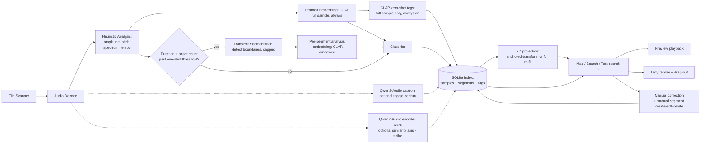

# Sample Library Search & Mapping Tool — Specification

**Status: living spec.** *Last updated: 2026-09-07 (fourth round: §5.2 how the CLAP vector is made + whole-file windows, §9.6 worker processes, §10 process pool).* This document consolidates and supersedes [Sample proposal #1](samples001.md) and [Sample proposal #2](samples002.md), which remain on disk as the historical discussion trail (why each decision was made, what alternatives were considered, the back-and-forth that resolved open questions). This document states the *current* design directly, without the proposal/delta framing — update it in place as the design keeps evolving.

---

## 1. Purpose & Non-Goals

You produce music in Bitwig Studio 6.1 with a large sample collection at `D:\_soundPacks` (**~110,000 files, ~340GB** — confirmed, §3) that's too large to browse by folder-diving, and which Bitwig's own browser isn't built to search by "a sound like this one."

**Goal:** a standalone desktop application that:
1. Automatically classifies every sample against a taxonomy matching how you actually think about your sounds (§4).
2. Places samples on an explorable similarity map (§9) — acoustically/perceptually similar sounds sit near each other.
3. Lets you pick any sample and ask "find me more like this," with the comparison basis itself under your control (§5, §9.5).
4. Recognizes one-shot hits embedded inside longer samples, making them independently findable (§6).
5. Gets the chosen sound into Bitwig with minimal friction (drag-and-drop).

**Explicit non-goals:** not a sampler, drum machine, or playable instrument — no pads, no kit-building, no slicing/mangling engine, no batch "export sliced kit" builder. Not a replacement for Bitwig's browser in general, just for "I know the vibe but don't know which file it's in." No cloud dependency.

---

## 2. Prior Art

- **Algonaut Atlas 2**: a granular instrument plugin with a 2D similarity pad, scoped to playing/mangling a curated kit of dozens-to-hundreds of hits — not a whole-library index, not extensible to a custom taxonomy.
- **Sononym**: the closest existing match to this idea — standalone, acoustic-similarity search, keyword/tag search, DAW drag-out. Worth evaluating independently; its similarity model and taxonomy aren't customizable, and its current support/development status is unverified.
- **XLN Audio XO**: a drum-specific plugin, 2D similarity pad for one-shots only — good UX reference, not a general library tool.

**The gap this fills:** a non-plugin, fully-customizable, locally-run tool combining a 2D similarity map, facet filters, "find similar," and drag-out — matched to *your* taxonomy and *your* similarity definition, not a fixed one.

---

## 3. Library Facts & Constraints

Confirmed, gating several downstream decisions:

| Fact | Value | Consequence |
|---|---|---|
| Library size | **~110,000 files, ~340GB** at `D:\_soundPacks` | Full-library operations (embedding every file, fitting UMAP over everyone) are multi-hour-to-multi-day jobs, not background afterthoughts — this is *the* reason the folder-scope list (§9.6) and anchored-only recompute (§9.6) exist, not a nice-to-have |
| Hardware | **CPU only, no GPU** | CLAP stays comfortably CPU-viable; Qwen2-Audio's real per-file cost is unmeasured and is why it's an opt-in toggle, not a default (§5.2) |
| Testing approach | **All testing done on a much smaller subset**, not the full library | Directly motivated the folder-scope list — see §9.6 |
| OS | **Windows only — confirmed, cross-platform explicitly not in scope** | No macOS/Linux packaging or testing burden; free to lean on Windows-specific mechanisms (e.g. `CF_HDROP` drag) without a portability tax |
| File-format mix | **Measured directly from `D:\_soundPacks`** — see breakdown below | Confirms decoder scope for Phase 1 and a concrete new decision on RX2 |

**Actual extension breakdown** (108,720 files total, recursive scan):

| Extension | Count | % | Category |
|---|---|---|---|
| `.wav` | 78,519 | 72.2% | Audio — primary format, as expected |
| `.atp` | 6,878 | 6.3% | Non-audio (instrument/preset container) |
| `.flac` | 5,643 | 5.2% | Audio — compressed lossless, needs decode support |
| `.rx2` | 4,807 | 4.4% | **Recycle-sliced audio, not raw PCM** — see decision below |
| `.nka` / `.nki` / `.exs` / `.fxp` / `.sfz` and similar | ~7,800 combined | ~7% | Non-audio instrument/preset containers — reference external audio, aren't audio themselves |
| Everything else (images, docs, MIDI, system files) | ~5,100 | ~4.7% | Non-audio |
| `.aif`/`.aiff`, `.mp3`, `.m4a` | 14 total | ~0% | Negligible — not worth special-casing |

**Decisions this resolves:**
- **WAV + FLAC** cover ~77% of the library and are both handled natively by `soundfile`/`librosa` — no extra work.
- **The ~7,800 preset/instrument-container files** (NKI, EXS, FXP, SFZ, NKA, etc.) are non-audio by design — confirmed as skip-and-log in Phase 1, exactly as originally planned. Worth a stretch-goal note: SFZ/EXS files are text/binary *maps* pointing at real audio files elsewhere in the same pack — parsing them later for extra metadata (root key, velocity range) is a plausible Phase 13 idea, not MVP scope.
- **RX2 (4.4%, ~4,800 files) is a real, non-trivial chunk — new decision needed.** Recycle's format isn't decodable by `soundfile`/`librosa`/`ffmpeg`. For MVP: **skip-and-log**, same as the other non-audio containers, rather than invest in a REX2 decoder now. Revisit only if this volume turns out to matter in practice once the tool is in daily use.

**Rough cost arithmetic worth keeping in view:** even at an optimistic ~0.5s/file for CLAP alone on CPU, 110,000 files is ~15 hours of continuous compute for *one* pass of *one* (the cheapest) model. **That figure undercounts, because segments get their own CLAP embeddings too** (`C2`, §7): if 20–30% of the library is loop/multi-hit material averaging 2–3 segments each, the embedding pass alone lands closer to **~25–40 hours**, not 15. Qwen2-Audio captioning (§5.2) is a separate order of magnitude on top of that, if enabled.

Two mitigations follow directly from this, both in §9.6's settings:
- **Minimum length for segment embedding** — sub-~200ms windows rarely yield a useful CLAP vector; skipping them cuts the segment multiplier without losing much.
- **An "embed segments" toggle**, alongside the Qwen2-Audio toggle — segment detection is cheap and can stay on while the expensive per-segment embedding is deferred.

This is the concrete justification for §9.6's whole design: nothing expensive ever targets "everything" by accident.

*Measured, Phase 4 (2026-09-06):* CLAP on this CPU runs at **0.05 s per 10-second clip** batched, and a full index pass came to **0.21 s per sample including its segments** (943 samples + 1,429 segment windows in 196 s, with a second model run competing for the CPU). Extrapolated: **~6.5 h for the 110k-file library with segments**, not 25–40 h — the estimate above was an order of magnitude pessimistic for CLAP. Heuristic analysis (0.26 s/file) and segmentation (0.39 s/candidate) are now the comparable costs.

*Measured again on a foley/ambience mix (2026-09-06, the 3,956-file Krotos starter library, median 1.25 s but with drones up to 16 min):* scan 45 s; analysis 815 s (0.21 s/file — the long ambiences dominate); segmentation 187 s; CLAP 506 s for 3,956 samples + 5,512 segment windows. **0.38 s/file all-in, ≈ 12 h extrapolated to the full library** for content like this, roughly double the drum-pack figure above. Both numbers bracket the real cost; the folder-scope list (§9.6) is what keeps either from being paid by accident.

---

## 4. Taxonomy

Two independent facets, not one rigid tree — this keeps the classifier simpler and filtering more composable.

**Facet A — Content class**

| Class | Description |
|---|---|
| **Rhythmic** | Drum hits, foley, synthetic percussive hits, drum/music loops |
| **Melodic** | Synth/instrument recordings, tonal loops and phrases |
| **Vocal** | Spoken word, vocal one-shots/adlibs, vocal phrases/loops |
| **Other** | Textures, drones, risers/impacts, ambiences — a deliberate catch-all so the classifier isn't forced to mislabel edge cases |

*Reliability (2026-09-07, first real use):* Facet A is CLAP's zero-shot guess (Phase 4), 68–73 % right on drum packs and visibly worse on foley — a machine-gun burst came out *Vocal*. The UI therefore shows **CLAP's numbers instead of the label** (2026-09-07, the user's steer): all four softmax probabilities are stored (`text_tags`, one `clap-class` row per set) and appear as four sortable columns in the list, as bars on the Attributes tab with each set's twelve prompts in the tooltip, and as a minimum-score filter per set; the map never colours by them. `classification.content_class` (the argmax with its threshold) stays in the index for §11 but is no longer displayed. Whether the four classes are the right taxonomy for this library at all is an open question raised by the user; the alternatives are §11's manual correction on top of it, or replacing it (folder-derived or user-defined categories). Nothing else in the design depends on the answer.

**Facet B — Structural type**

| Type | Description | Detected via |
|---|---|---|
| **One-shot** | Short, single transient | Short duration + one dominant onset |
| **Multi-hit** | Longer, several transients, still reads as "a hit" | Few onsets, no steady periodicity, no loop metadata |
| **Loop** | Long, many transients, tempo-syncable | Many periodic onsets, detectable tempo, and/or embedded loop metadata |

*Detection notes (Phase 2, tuned on 500 labeled library files — journal 2026-09-06):* the one-shot duration cap is the §9.6 setting "One-shot max duration" (on by default at 2 s; off = any length). Onsets are counted on the HPSS **percussive component** with superflux, and only **dominant** ones count (≥30% of the strongest onset's strength and ≥20% of the file's loudest moment) — ringing partials of a glass/metal hit otherwise read as a burst of onsets. "Tempo-syncable" is tested literally: a loop is a **whole number of beats long** (≥ 1 bar) at its tempo. Tempo sources, in order of trust: ACID beat count (exact), a `<n> BPM` token in the filename confirmed by the whole-beat duration, then acoustics (a genuine autocorrelation peak, onsets spanning the file and sitting on the 16th-note grid). `smpl` loop points are a sampler's sustain region, not a loop signal.

Every sample gets one content class + one structural type, plus free-text tags. **The map's spatial layout is driven by acoustic similarity, not by taxonomy** — taxonomy is color-coding and filters *on top of* the similarity layout (§9.3).

---

## 5. Similarity Model

### 5.1 Hybrid: descriptors + learned embedding

A single learned embedding is a black box — insensitive to exact pitch/loudness, and it can't tell you *why* two sounds match. So similarity is a blend of two layers, normalized and combined (§9.5 covers the actual per-axis control panel):

| Axis | Concrete descriptors | Notes |
|---|---|---|
| **Amplitude** | Peak/RMS level, crest factor, attack time, decay time | Also a signal for structural type (fast attack = percussive-reading) |
| **Pitch** | `librosa.yin` fundamental frequency + voicing confidence (`pyin` reserved for an optional quality pass — it's Viterbi-decoded and by far the slowest descriptor, a multi-hour line item on its own at 110k files) | Gated on `harmonic_ratio`, which comes from **HPSS** (`librosa.effects.hpss`) — a separate, cheap computation, *not* a pitch-tracker output. The gate is not circular: HPSS energy ratio decides whether pitch tracking runs at all; pyin/yin's own voicing confidence is a different quantity, recorded only for samples that pass the gate |
| **Timbre** | MFCCs (mean+variance), spectral contrast | The "same instrument/material" descriptor set |
| **Spectrum** | Spectral centroid, bandwidth, rolloff, flatness | Brightness/noisiness independent of pitch |
| **Conceptual** | CLAP embedding | The "sounds alike even if descriptors don't agree" catch-all; also the text-search backbone |
| **Vocal-semantic** *(optional, §5.3)* | Qwen2-Audio encoder latent | Speech/vocal-nuance axis CLAP wasn't optimized for — unconfirmed, spike-gated |

All descriptor computation stays in `librosa`/`numpy`/`scipy` — no new dependency.

*Implemented (Phase 7, 2026-09-07, `similarity.py`):* every scalar is standardised robustly over the whole population (median / MAD, clipped at ±4) so no descriptor dominates its axis; Amplitude = peak, RMS, log crest, log attack, log decay; Pitch = log₂ f₀ (absent below the gate, so unpitched material simply has no pitch axis); Timbre = 13 MFCC means + 13 log MFCC variances + 7 spectral-contrast bands; Spectrum = log centroid, log bandwidth, log rolloff, flatness; Conceptual = 1 − cosine on the CLAP vectors. Each axis distance from the anchor is scaled by its 95th percentile over the population (clipped to 1) so the five axes are comparable before the weights blend them — the blend is the weighted mean over the axes an item *has*. Samples and segments are both items: a segment that beats its parent is the parent's sub-hit (§9.4).

### 5.2 Audio-to-text tagging

Two models, different jobs, not a bake-off:

| Signal | Source | Job | Status |
|---|---|---|---|
| Zero-shot labels + retrieval embedding | **CLAP** | Fast text↔audio matching, the default text-search box, cheap fallback tags | Always on, CPU-cheap |
| Natural-language caption | **Qwen2-Audio** | A real descriptive sentence per sound | **Optional, toggle-gated** (§9.6) — off by default. Captioning needs the *full* model (~8.4B params, ~17GB in bf16), including the language decoder, and autoregressive decoding on CPU runs at roughly 1–3 tokens/sec even quantized. A ~30-token caption is therefore realistically **tens of seconds to minutes per file**, not seconds — at 110k files that's weeks, not hours. Treat a quantized/CPU-oriented build as the likely prerequisite for using this at any scale, not a fallback |

`bosonai/higgs-audio-v2-tokenizer` was evaluated and dropped — it's a generative TTS/voice tokenizer, not trained with a text-audio contrastive objective, and a poor fit for retrieval.

**Where this shows up:** free-text search box (CLAP), auto-suggested/editable tag chips (CLAP + Qwen2-Audio when enabled), optional semantic cluster labels on the map.

*How the vector is made (2026-09-07, after the user asked):* CLAP's audio encoder takes a fixed 10-s window at 48 kHz. A shorter clip is **repeat-padded** by the feature extractor (a 1-s hit is tiled to fill the window — how the model was trained, and the reason a lone hit can read as "rhythmic"); a longer file used to contribute only its first 10 s. Now a file is embedded as the **mean of its 10-s windows** (contiguous up to 24, beyond that 24 spread evenly across the file), re-normalised — the usual whole-clip embedding for a fixed-window model. Segments keep their own window vectors (§6.4). The 512-number vector is stored for every sample and segment (`embedding` / `segment_embedding`), shown as colour stripes on the Attributes tab, and `crate-embed --export FILE.npz` writes them all for use outside Crate. *Since 2026-09-08* each window's vector is kept as a `window` segment (§6.4), so both the whole-file mean and the parts it is made of are searchable; the export's `methods` array tells them apart.

### 5.3 Open research item: Qwen2-Audio's latent space as a similarity axis

Genuinely unresolved, kept as a priority anyway — **it's the one similarity signal none of Atlas 2, Sononym, or XO offer**, i.e. this tool's actual distinguishing feature if it pans out. Qwen2-Audio's audio encoder is Whisper-style, trained speech-heavy — plausibly captures vocal/speech nuance (speaker timbre, prosody) that CLAP wasn't optimized to distinguish.

**Spike plan:**
- Mean-pool (or attention-pool) the encoder's hidden states before the language-model decoder — expect to try more than one pooling strategy/layer; there's no documented "correct" one the way there is for CLAP.
- Hand-picked evaluation set: known-similar/dissimilar pairs (two takes of the same phrase, two performances by the same voice, a drum hit vs. its layered variant, unrelated foley). Compare CLAP's nearest-neighbor rankings against the pooled Qwen2-Audio vector's — agreement, complementary-but-sensible divergence, or noise.
- Rides on the same small-subset benchmark as §5.2's cost measurement — one spike, not two.
- A positive result adds a selectable axis (§9.5); it doesn't replace CLAP.

---

## 6. Transient Segmentation

### 6.1 What it solves

A 1c drum loop is *made of* individual hits; a lot of multi-transient foley/synth takes are really several usable one-shots recorded in one file. Right now those hits are invisible to search. This makes them discoverable without turning the app into a slicer.

### 6.2 Detection (automatic)

Runs for anything not already a clean single-hit one-shot, fully configurable (§9.6):

- **Onset-detection profile**, auto-selected by content class: *tight/percussive* (HFC/complex-domain) for Rhythmic/Loop content; *loose/gesture* (energy-based, with onset-merging) for multi-transient-hit content — this governs *how onsets are detected*. *(Implemented: `auto` reads both facets — tight when Facet B is Loop or Facet A is Rhythmic, loose otherwise; before Phase 4 has run, or when Facet A is flagged, only Facet B decides.)*
- **Transient sensitivity**: configurable threshold for how strong a transient must be to count as a candidate at all.
- **Boundary mode** — *how a segment ends*, orthogonal to the profile above: **transient-to-transient** (stop at the next onset, breakbeat-chop style) or **transient-to-fixed-length** (extend a fixed duration regardless of internal sub-transients, for gestures that should stay whole). Default: transient-to-transient. In fixed-length mode, the fixed duration reuses the **max segment length** setting.
- **Length constraints** (auto-detection only): configurable min/max length (seconds or % of parent duration). Too-short → **dropped** (noise). Too-long → **truncated at the max**, not dropped — an obvious transient still yields a segment.
- *Implementation notes (Phase 3):* the tight profile is superflux spectral flux on the HPSS percussive component, the loose profile is half-wave-rectified energy flux on the full mix plus onset merging. Tight cut points are **backtracked** to the preceding energy minimum so a segment does not clip its own attack, bounded to ~46 ms of look-back — an unbounded backtrack was measured reaching 128 ms, far enough to swallow the previous hit's tail. The loose envelope already rises before the attack, so it is not backtracked.
- **Per-sample cap** (auto-detection only): **5 segments per sample** (adjustable). When candidates exceed the cap, the **strongest transients win**; if the cap actually binds, the sample is flagged with a visible "capped" warning (effective sensitivity was raised to fit) rather than a silent drop.

### 6.3 Manual segments — exempt from every automatic constraint

You can create or adjust a segment by hand: drag start/end markers on the header's waveform preview (§9.2), press **Save segment**. This is deliberate and protected — nothing is written until saved, and once saved it's excluded from automatic overwrite (mirrors classification-correction protection).

**None of §6.2's constraints apply to a manual segment** — no min/max length check, no cap, no truncation, no eviction. A hand-placed marker is never touched by the automatic pipeline. You can still delete one yourself via an explicit **Delete segment** action — that protection is against silent automatic overwrite, not against your own deliberate edits.

If the parent file's *content* changes underneath a manual segment, its markers still stay where you put them, but its derived data is redone against the new audio (descriptors, cached render) and, if it now ends past the end of the file, it is flagged `needs_review` for you to fix or delete.

### 6.4 Segments are indexes on a sample, not separate items

A segment is not a peer entity to a real file — it's a lightweight index record (start/end marker pair) attached to its parent, stored in its own tables (§8), not shown as its own map point or list row by default.

- Gets its **own embedding** (needed for similarity — it's what would place a buried snare near other snares even though it lives inside a loop file) and a lightweight classification (structural type fixed to One-shot, content class copied from parent).
- Does **not** get its own caption/tags — inherited from parent, keeping captioning cost proportional to file count, not segment count.
- **Surfaces only on match**: when search/similarity finds a segment is the actual best match (not its parent), it appears as a labeled sub-hit — an indented "hit within `<parent>` @ 1.2s" row in List, a badge on the parent's map point. Otherwise, a sample's segments live only in that sample's own drill-down view.
- **CLAP windows — the third kind of segment** *(2026-09-08, the user's steer)*: a file longer than the model's 10-s input is embedded through several windows (§5.2), and each window is kept as a segment row of its own kind — `detection_method = 'window'`, its own vector, no strength, no descriptors, no classification — so a search or a ranking can land at minute seven of an ambience the way it lands on a detected hit: an indented "↳ window @ 7:10.250 (10 s)" row, a badge on the map, previewable and draggable like any segment. Windows are **derived** rows: the embedding stage writes them whenever it computes a parent's windows (and backfills an index from before they existed without touching the parent's vector), replaces them on re-embed, keeps them regardless of the *Embed segments* toggle (their vectors come free with the whole-file one), and drops them when a file shrinks to one window. They are never listed in the drill-down table, never counted as segments (the list's *Hits* column, the status bar), and on the waveform they are a thin strip along the bottom of the plot, the selected one a band. A window carries the conceptual axis only, so under a ranking it scores on that axis alone (the blend skips what an item lacks, §5.1) and has no score when the conceptual weight is zero — the four DSP axes were designed for one-shots and loops, not for a slice of an ambience, and describing every window would cost several times the model pass. At most 24 rows per file (§5.2); the user's index gained 6,036 rows over 2,028 files (10,140 samples), in 549 s of backfill, 168 → 194 MB.

### 6.5 Lazy rendering

Detection and embedding happen in-memory during analysis (cheap, no disk write). Audio is only physically rendered to a small cached WAV (short fade-out) the first time you preview or drag that specific segment — the cache is disposable/LRU-evictable, trivially regenerable from parent + offsets. *(Implemented, Phase 4.5: `%LOCALAPPDATA%\Crate\cache\segments\seg_<id>.wav`, parent's native rate/channels/PCM subtype, 2 ms fade-in + 20 ms fade-out; `segments.cache_path` is cleared when the markers or the parent's content change. Eviction is still Phase 12.)*

### 6.6 Scope boundary

Transient detection **for findability**, not a slicing/re-sequencing instrument. No pad grid, no drag-to-reorder, no batch kit-export. Bitwig's own Sampler slicing already covers persistent sliced-instrument authoring if that's ever wanted separately.

---

## 7. System Architecture



Key execution guarantees:
- **`D` (full-sample CLAP embedding) depends only on `C`, never on `S`** — it runs unconditionally, whether or not the sample also gets segmented. Segmentation only ever gates itself, never the base embedding.
- **Audio-to-text has three commitment levels, not one**: `X` (CLAP zero-shot) is solid — always runs. `X1` (Qwen2-Audio caption) is dashed — optional, toggle-gated (§5.2). `X2` (Qwen2-Audio latent) is dashed for a different reason — an unconfirmed research question (§5.3), not a feature yet.
- **`G` runs one of two ways** depending on Recompute scope (§9.6): anchored-only uses the existing fitted model's out-of-sample transform (cheap, moves only the anchor); whole-library/folder-scope does a full re-fit (expensive, moves everyone in scope). Out-of-sample transforms accumulate drift — points inserted this way are placed against an increasingly stale fit — so a full re-fit is worth running after a meaningful number of anchored inserts, or whenever the folder scope changes materially. The `map_layout` row (§8) records which fit the current map came from, making that staleness visible rather than invisible.

### Process Reference

| Node | Task | Inputs | Outputs |
|---|---|---|---|
| **A — File Scanner** | Recursively walk `D:\_soundPacks`, filter/log unsupported formats, diff against last run. A file that vanished and one that appeared with the same content is a **move/rename**: the row is updated in place so everything hanging off it (corrections, manual segments, embeddings) survives a folder reorganisation | Root path; prior scan state | Worklist of new/changed files; skeleton `samples` row per new file |
| **B — Audio Decode** | Load audio into a normalized in-memory form | `filepath` | Decoded waveform buffer; `duration_s`/`sample_rate`/`channels`; decode failures logged, not fatal |
| **C — Heuristic Analysis** | Amplitude/pitch/timbre/spectrum descriptors (§5.1) + tempo/onset/loop-ness, incl. embedded `acid`/`smpl` metadata | Decoded buffer | `analysis` row; supplies the signal `S` reads |
| **D — CLAP embedding (full sample, always)** | The "conceptual" similarity vector; basis for `X`'s zero-shot labels | Decoded buffer, full sample | `embedding` row (`model_name='clap'`) |
| **S — Segmentation decision** | Cheap gate: already a clean one-shot, or a segmentation candidate? | `duration_s`, `onset_count` | Routes to `T` or `E`; never gates `D` |
| **T — Transient Segmentation** | Detect boundaries per §6.2 (profile, sensitivity, mode, length rules, cap+warning) | Decoded buffer; onset/tempo signals; configured settings | New `segments` row(s); updates parent's `segment_candidates_found`/`segments_capped`/`effective_sensitivity` if capped |
| **C2 — Per-segment analysis + embedding** | Same descriptor/CLAP extraction as `C`/`D`, windowed, in-memory | Decoded buffer sliced to segment window; `segments` row | `segment_analysis` + `segment_embedding` rows |
| **X — CLAP zero-shot tagging** | Zero-shot labels from CLAP embedding vs. text prompts | `embedding` (from D) | `text_tags` row(s), `source_model='clap-zeroshot'` |
| **X1 — Qwen2-Audio captioning** *(optional toggle)* | Natural-language caption | Decoded buffer (raw audio, not CLAP's vector) | `text_tags` row, `source_model='qwen2audio-caption'`, when enabled |
| **X2 — Qwen2-Audio latent** *(spike, optional)* | Pooled encoder representation as a candidate similarity axis | Decoded buffer | If validated: `embedding` row, `model_name='qwen2audio-latent'`. Until then: spike report only |
| **E — Classifier** | **Facet B (structural type): rule-based** on descriptors — duration, onset count/periodicity, tempo confidence, embedded loop metadata. **Facet A (content class): CLAP zero-shot** prompts mapped to the four classes, with descriptor tie-breaks (e.g. harmonic ratio pushing Melodic vs. Rhythmic) and a confidence threshold below which the sample is flagged rather than assigned. No trained/custom model — deliberately, since manual corrections (§K) are the intended long-run accuracy path | `analysis`/`embedding` or `segment_analysis`/`segment_embedding` | `classification` or `segment_classification` row; low-confidence flagged |
| **F — SQLite index** | Persistent store | All of the above | Queryable DB for `G` onward; write-back target for `K` |
| **G — 2D projection** | Anchored-only: transform just the anchor into the existing layout. Whole-scope: full re-fit | `embedding`/`segment_embedding` rows in scope; prior fitted model (anchored path) | `map_x`/`map_y` on the rows actually in scope |
| **H — Map/Search/Text-search UI** | The interactive surface | Everything in `F`; live filter/search/anchor input | View state; hands off to `I`/`J`/`K` |
| **I — Preview playback** | Audition a sample or segment | `filepath`, or parent `filepath`+offsets | Audio out; no DB write |
| **J — Lazy render + drag-out** | Render trimmed/faded WAV on first use; hand OS a real file path | Target id; cache state | Cache file (first use); native OS drag/file event |
| **K — Manual correction** | Override classification/tags, or create/edit/delete a segment | User action + target id | Updated row(s), `is_user_confirmed=true`, protected from automatic overwrite |

---

## 8. Data Model

```
samples                                             -- real files only
  id, filepath, filename, folder, duration_s,
  sample_rate, channels, added_at, last_scanned_at,
  file_size, file_mtime,        -- cheap change key: the re-scan diff compares these first
  file_hash (nullable),         -- full content hash, computed ONLY when size/mtime changed
                                -- (hashing all 340GB on every re-scan is a disk-bound non-starter)
  content_changed_at,           -- stamped by the scanner on insert and on a genuine content change
                                -- (never on a hash-identical retouch). Any derived row whose own
                                -- timestamp is older than this is STALE — flagged, never
                                -- auto-recomputed (§9.6 "Rescan library")
  segment_candidates_found,     -- segments proposed after the length rules, BEFORE the cap;
                                -- NULL = never segmented, which is what makes "segmented and
                                -- found nothing" distinguishable from "not yet segmented"
  segments_capped, effective_sensitivity,
  segments_detected_at          -- stale when older than content_changed_at (same rule as analysis)

analysis                                            -- samples only
  sample_id (FK), analyzed_at,  -- stale when older than samples.content_changed_at
  tempo_bpm,                    -- loops only: NULL unless explicitly recognisable (ACID beat
                                -- count, or acoustic periodicity that passed the loop rule)
  tempo_confidence, onset_count,
  is_loop, key, harmonic_ratio, embedded_metadata_json,
  peak_db, rms_db, crest_factor, attack_ms, decay_ms,
  f0_hz, pitch_confidence, mfcc_mean, mfcc_var, spectral_contrast,
  spectral_centroid, spectral_bandwidth, spectral_rolloff, spectral_flatness

embedding                                           -- samples only
  sample_id (FK), model_name, vector (blob),        -- float32, L2-normalised (cosine = dot)
  embedded_at                                       -- stale when older than samples.content_changed_at
  -- model_name: 'clap', or 'qwen2audio-latent' if §5.3's spike is adopted
  -- map coordinates live in map_position, not here — see map_layout below

text_tags                                           -- MACHINE output only; samples only, segments inherit
  sample_id (FK), tag_or_caption, source_model, score, is_user_confirmed (bool), created_at
  -- source_model: 'clap-zeroshot' (tag chips, score = cosine) | 'clap-class' (node E's best
  --               Facet A guess with its confidence — kept even when the sample is flagged,
  --               so a low-confidence call is visible, not lost) | 'qwen2audio-caption'
  -- Flow: models write here as suggestions. When you accept or edit a suggested chip,
  --       it is promoted into tags/sample_tags below. text_tags is therefore the raw
  --       model layer (regenerable, disposable); tags/sample_tags is the curated layer
  --       (user-owned, never overwritten by a recompute).

tags, sample_tags                                   -- CURATED user-owned tags, samples only

classification                                      -- samples only
  sample_id (FK), content_class, structural_type,   -- Facet A / Facet B (§4)
  confidence,                                       -- node E's flag-threshold input
  provenance ('automatic' | 'manual'), source_model, is_user_confirmed (bool)
  -- segment_classification below mirrors these column names

crates, crate_samples                               -- samples only, standard shape

map_layout                                          -- one row per computed layout
  id, computed_at, scope_description,               -- e.g. 'whole library' / a folder-scope label
  blend_weights_json,                               -- the per-axis weights the fit used
  umap_params_json, random_seed, is_current (bool)
  -- Map coordinates are a function of weights + scope + UMAP fit, NOT of any single
  -- embedding model — so they can't live meaningfully on a per-model embedding row.
  -- This makes "the last explicitly-computed layout" (§9.3) an unambiguous reference,
  -- and makes it visible when the current map was fit under weights you've since changed.

map_position
  layout_id (FK), sample_id (FK, nullable), segment_id (FK, nullable), map_x, map_y
  -- exactly one of sample_id/segment_id set

segments                                            -- the index records
  id, sample_id (FK, NOT NULL), start_ms, end_ms,
  detection_method ('auto' | 'manual' | 'window'),   -- 'window' (§6.4): one of the CLAP windows of a long
                                                    -- file, written by the embedding stage, vector only
  is_user_confirmed (bool),                         -- true once manually saved; protects from auto-overwrite
  strength,                                         -- onset strength as a fraction of the parent's
                                                    -- strongest; the cap's strongest-first tie-break
  detected_at,                                      -- stale when older than the parent's content_changed_at
  needs_review (bool),                              -- manual segment whose parent's content changed and which
                                                    -- now ends past the file: bounds are never auto-edited (§6.3),
                                                    -- so it is flagged for the user instead
  cache_path, cache_rendered_at
  -- UNIQUE (sample_id, start_ms, end_ms, detection_method); ON DELETE CASCADE from samples

segment_analysis          -- mirrors `analysis`, segment-scoped (no is_loop/key/embedded_metadata_json)
  segment_id (FK), tempo_bpm, onset_count, harmonic_ratio,
  peak_db, rms_db, crest_factor, attack_ms, decay_ms,
  f0_hz, pitch_confidence, mfcc_mean, mfcc_var, spectral_contrast,
  spectral_centroid, spectral_bandwidth, spectral_rolloff, spectral_flatness

segment_embedding          -- mirrors `embedding`
  segment_id (FK), model_name, vector (blob)
  -- coordinates (via map_position) exist only for the parent-badge/nested-hit display,
  -- never as an independent plotted point

segment_classification     -- mirrors `classification`, minimal
  segment_id (FK), content_class (copied from parent), structural_type (= 'one-shot'),
  confidence, is_user_confirmed
```

Segments live in their own parallel tables rather than as self-referential `samples` rows — this matches the mental model directly (a `segments` row reads as "an index into a sample," never "a sample masquerading as another sample"), and every sample-facing query (map, list, filters) never needs to know segments exist at all.

---

## 9. UI Design

Two established interaction patterns — Atlas 2's spatial map, Sononym's sortable list — as two views over one shared filtered/ranked dataset. The piece neither offers directly: the **comparing factor** is a genuine choice, not a fixed property of the data.

### 9.1 Layout

*Look (2026-09-07, on the user's steer — the default widgets read as "basic HTML"): one dark theme in the idiom of production tools, `theme.py` — Fusion style, a palette and a style sheet applied once by `main()`, and the same colour constants used by the painted map and waveform, so the window reads as one surface. Panels squeeze to their pane and fall back to a scrollbar rather than clipping.*

```
┌──────────────────────────────────────────────────────────────────────────┐
│  Crate                                              [ Map ]     [ List ]  │  ← header row 1
├────────────────────────────────────────────────────────────────────────── │
│ ▶ break_140bpm.wav @ 1.2s  [waveform▂▃▅▇▅▃▂...]   [⚓ Anchor]  [Drag ↗]   │  ← header row 2
├──────────────────────────────────────────────────────────────┬───────────┤
│                                                                │ Attributes│  ← right panel, 2 tabs
│                     map canvas / list table                   │ Recompute │
│                     (full remaining width — no left panel)    │           │
└────────────────────────────────────────────────────────────────┴───────────┘
```

### 9.2 Header — preview, anchor, drag-out, manual markers

- **View switch** (`Map`/`List`), always visible.
- **Preview**: whatever's selected loads here — waveform, play/stop.
- **⚓ Anchor**: pins the current sample/segment as the comparison reference — unlocks the Attributes tab's per-axis ranges (§9.5) and is a prerequisite for Recompute ranking (§9.6).
- **Drag ↗**: native OS drag onto Bitwig; a not-yet-cached segment transparently triggers lazy render first.
- **Manual markers**: draggable in/out points on the loaded waveform. Staged on drag, committed only via **Save segment** (never live), exempt from all automatic constraints (§6.3). **Delete segment** removes one — automatic or manual — deliberately, at any time.

*(2026-09-07, on the user's steer after first use: the waveform strip is built as the **bottom panel** rather than the header — `waveform.py`: the selected sample's waveform, every segment as begin/end markers with its strength (manual ones green, `needs_review` flagged), the measured attack and decay drawn as the envelope (§5.1's Amplitude axis; a recording has no ADSR beyond that), and the preview's playhead; click inside a segment to preview it, elsewhere to seek. Files over 30 s are read on a thread (a 16-minute ambience took 4.7 s). Anchor and Drag stay in the transport row; the segments table moved to the Attributes tab. The CLAP windows of a long file (§6.4) are a thin strip along the bottom of the plot; a window that is the current hit is a band across the full height. Marker editing is Phase 9.)*

### 9.3 Map view

One point per **sample** (segments never get their own point), positioned by the last explicitly-computed layout, colored by content class *(since 2026-09-07, on the user's steer: coloured by the current **score** — the last ranking's similarity to the anchor, or the current search's match — and one colour when there is neither; static groupings such as folder or the CLAP class were tried and dropped, since a library of hundreds of kinds of sound needs a colouring that comes from what the user is doing)*, sized/shaped by structural type. Clicking previews; if anchored and ranked, nearest neighbors highlight as a halo (last-computed, not live). A **segment match badge** appears on a sample's point when a search/similarity hit actually lands on one of its segments rather than the sample itself.

*(Implemented 2026-09-07, Phase 6, `layout.py` + `mapview.py`: node G fits UMAP over the §5.1 feature space under the weight bars at fit time — each axis's standardised columns scaled by √(weight / dim), the CLAP vector as the conceptual axis — over the samples in the folder-scope list, writes a `map_layout` row + one `map_position` per sample, and pickles the fitted reducer so the anchored-only path can `transform` one sample into the existing layout; segments get no point. The view is a plain painted widget: colour by class, circle / square / diamond by type, the list's filter mirrored, click = select in the list (preview), double-click = play, wheel/drag = zoom/pan, right-click = fit; the halo is the last ranking's 20 nearest, the badge the current search's or ranking's segment hits. The caption names the layout, its scope, reducer and time, and says when the bars no longer match the weights it was fit under. Without the `map` extra a PCA projection stands in and says so. Measured: 3,956 samples in 20 s with UMAP, one-sample placement 2 s.)*

### 9.4 List view

Sortable/filterable table of samples. Once anchored **and** ranked (§9.6), a **Similarity** column appears (stable until the next explicit recompute). Ranking results are **view state, not persisted** — they're cheap to regenerate and meaningless without their anchor. What *does* persist across restarts is the anchor itself and the weight settings, so a fresh session is one click from reproducing the same ranking rather than needing it stored. **Nested sub-hit rows**: a segment that's the actual best match appears as an indented "hit within `<parent>`" row under its parent — the concrete mechanism keeping segments findable without cluttering the default view.

*(Implemented 2026-09-07, Phase 7: a two-level list — samples, and under a sample at most one "↳ hit @ …" row ("↳ window @ …" when the best part of a long file is one of its CLAP windows, §6.4) when its best segment beats it for the current search or ranking; the parent inherits that score so it sorts by its best hit. A **Similarity** column appears once anchored and ranked, a **Match** column once searched; both are view state. Selecting or dragging a sub-hit previews / hands out the rendered segment. The anchor and the weights persist across restarts as specified; the anchor itself is a minimal ⚓ button in the transport row until Phase 9's header lands.)*

### 9.5 Attributes tab — merged filters + comparing-factor weights

Top to bottom: **(1)** weight bars per axis (Amplitude/Pitch/Timbre/Spectrum/Conceptual, plus Vocal-semantic if §5.3 ships) — set the blend used on the *next* recompute, no presets for now. **(2)** free-text search (CLAP), instant. **(3)** filter criteria — content class/structural type checkboxes, duration/tempo absolute ranges (no anchor needed), and per-axis distance-from-anchor ranges (needs an anchor — computed once at anchor-time, then instant to adjust). Weight (blend importance) and range (hard cutoff) are deliberately separate controls on the same axis.

*(Implemented 2026-09-07, Phase 7, `attributes.py`: weight sliders per axis (persisted), the CLAP search box — the query is embedded on a worker thread, since the first use loads the model (20 s cold) — class / type checkboxes, length and tempo ranges (a tempo range excludes samples without a tempo), and per-axis distance-from-anchor ranges in % of the library's spread, unlocked by the anchor and instant since the distances are computed once at anchor time; a narrowed axis excludes samples that lack it. The selected sample's zero-shot chips sit under the search box; clicking one searches for it. Editing or promoting chips is Phase 11; the Vocal-semantic axis waits for Phase 5. **Reshaped 2026-09-07 on the user's steer:** the top block is now the per-axis *difference between the selected item and the anchor* — read-only bars in % of the library's spread, each axis with a tooltip saying what it measures; the segments table lives here (moved from the bottom panel, which shows the waveform); the class filter became four "CLAP score at least" boxes and a "CLAP scores of the selected sample" block shows the four probabilities with their prompt sets; the weight bars moved to the bottom under "Weights for the next ranking and map layout", since they only matter when Recompute is pressed.)*

### 9.6 Recompute tab — on-demand only, nothing automatic

Policy: **no map layout, ranking, or attribute recomputation ever runs automatically.** Every action is an explicit button press with an explicit scope.

**Two-way scope**, offered on the actions where it's coherent:
- **⚓ Anchored sample only** — the fast-iteration path: tweak a setting, run it against the one sample in front of you, check, repeat.
- **📚 Library scope** — runs across whatever the folder-scope list (below) defines.

| Action | What it does | Scope | Needs an anchor? |
|---|---|---|---|
| **Recompute ranking** | Re-sorts List's Similarity column by distance to the anchor | Library scope, or visible/filtered set only — no "anchored only" option, since ranking is *already* anchor-relative by construction; there's nothing to rank against just the anchor itself | Yes |
| **Recompute map layout** | Re-projects to 2D | Anchored-only = cheap UMAP transform of just the anchor into the existing layout; library scope = full re-fit, expensive | No |
| **Recompute attributes** | Re-runs analysis/embedding/classification/segmentation | Anchored-only, or library scope (sub-toggle: new/changed only, or force full re-index) | No |
| **Rescan library** | Runs the file scanner (`A`) only: finds new/changed/removed files and flags derived rows that are now stale (`content_changed_at`, §8). Cheap — no decode, no model. "New/changed only" above consumes exactly this flag; nothing is recomputed until you press it | Always the whole root (the scanner never scopes, see below) | No |

**Folder-scope list** (new, directly motivated by §3's real scale): a persistent, editable list of folders under `D:\_soundPacks` that defines what "library scope" actually covers for the actions above — **add folders to build up the scope**; there's no implicit "everything" default. To run against the true full library, add the root folder itself. The file scanner (`A`) still walks the entire root regardless, populating cheap skeleton `samples` rows (filepath/hash/duration) for all ~110,000 files — only the *expensive* steps (`C` onward) are gated by this list. This is what makes "all testing on a much smaller subset" (§3) practical: build the scope up folder-by-folder as confidence in the settings grows, rather than an all-or-nothing switch against a 340GB library.

*(Implemented 2026-09-06 — Phase 8 pulled forward to right after 4.5, because a window that only reads an index the CLI built is not usable on its own: **Rescan library**, the **folder-scope list** (persisted; empty scope refused, the root itself = whole library), **Recompute attributes** under library scope with both sub-modes and every setting in the table below except Qwen (Phase 5), a **Stop** that ends the current stage after its current file and keeps what was committed, and a log fed by the pipeline's own progress lines. The job runs on a worker thread with its own SQLite connection in the one process (§10); WAL keeps the list readable meanwhile and it reloads when the job ends. Recompute ranking arrived with Phase 7 and Recompute map layout — both scopes — with Phase 6, both on 2026-09-07; the anchored-only scope for Recompute *attributes* is what remains of this tab.)*

**Recompute attributes — its own settings** (apply under either scope; none constrain manual segments, §6.3):

| Setting | Controls | Default |
|---|---|---|
| Include Qwen2-Audio captioning | On/off (§5.2) | Off |
| Embed segments | On/off — segment *detection* is cheap and stays on regardless; this governs the expensive per-segment CLAP pass (`C2`), the library's real cost multiplier (§3) | On |
| Min length for segment embedding | Below this, a segment is still indexed but not embedded — sub-~200ms windows rarely yield a useful CLAP vector (§3) | 200 ms |
| Facet A confidence threshold | Node `E`: below this softmax confidence the content class is **flagged, not assigned** (`content_class` NULL, best guess kept as a `clap-class` tag). Four classes, so 0.25 is chance. Re-runnable from stored vectors without audio (`crate-embed --reclassify`). Measured on 335 labeled files: 0.5 assigns 90% of samples at 73% accuracy, 0.65 assigns 75% at 77% | 0.5 |
| Transient sensitivity | Threshold to trigger a candidate boundary | *(tuning pass expected)* |
| Min/max segment length | Seconds or % of parent duration; drop-short/truncate-long (§6.2) | *(tuning pass expected)* |
| Segmentation boundary mode | Transient-to-transient / transient-to-fixed-length (§6.2) | Transient-to-transient |
| Max segments per sample | Cap; strongest-first tie-break + capped warning (§6.2) | 5 |
| Worker processes | How many Python processes the analysis and segmentation stages fan out to (§10); the index is written by the window's own process regardless. Added 2026-09-07 | 8, or half the cores if fewer |
| One-shot max duration | **On:** a sample with at most one dominant onset is a one-shot only up to this length (§4 "short"). **Off:** length is ignored — a 2.2 s ringing metal lid *and* a 37 s kettle recording with one dominant onset are both one-shots. Added 2026-09-06 after 34 of a 322-file foley subset fell on the "long single onset" side; CLI: `--one-shot-max-duration` / `--one-shot-any-duration` | On, 2.0 s |

Manually-corrected samples and manually-saved segments stay protected from silent overwrite under either scope.

---

## 10. Technology Stack

*Parallelism (2026-09-07, the user's steer — a folder recompute used 5 % of a 32-core machine):* the per-file computation of analysis and segmentation (decode + descriptors + detection) fans out to a **pool of Python worker processes** (`parallel.py`, bounded submission, one BLAS thread per worker); the SQLite writes stay in the calling process, which remains the index's only writer. Set on the Recompute tab (*Worker processes*, default 8 or half the cores if fewer — measured: 8 workers 3× faster than one on 600 short files, 16 slower than 8) and `--workers` on the CLI. Still one Python codebase and no native component — the single-process rule below was about the latter. CLAP embedding stays in-process on the model's own threads.

Single-process Python for v1 — no C++ or Rust component planned.

| Component | Choice | Why |
|---|---|---|
| Language | **Python** | Best-in-class audio/ML ecosystem; the DSP libraries below are compiled/native under the hood anyway (BLAS/FFT), so Python here is an orchestration layer, not the bottleneck |
| Desktop UI | **PySide6 (Qt)** | Native OS drag-and-drop, one process/one language; PySide6 is a binding around real Qt C++, so map-rendering performance is a rendering-approach question (GPU-painted canvas vs. per-point widgets), not a language question |
| Audio I/O & classic DSP | **librosa + soundfile** (no aubio) | `librosa` covers onset/tempo/pitch (`onset.onset_detect`, `beat.beat_track`, `yin`) on numpy/scipy, wheel-installs cleanly, MIT-licensed. **aubio was evaluated and dropped** — see note below |
| WAV loop metadata | **Custom `smpl`/ACID chunk reader** | Neither `soundfile` nor `librosa` exposes these chunks, so node `C`'s "read embedded tempo/key/loop metadata" needs a small purpose-written parser (`smpl` is a simple struct; ACID is a documented fmt-chunk extension). Small, but real Phase 2 work — not free |
| Similarity/tagging embeddings | **CLAP** (always), **Qwen2-Audio** (optional caption, §5.2; optional latent axis, §5.3) | PyTorch models — no meaningful non-Python path exists for these regardless. CLAP is loaded through transformers' native `ClapModel` (`laion/clap-htsat-unfused`, 48 kHz, 10 s window) rather than the `laion-clap` package: same weights, one maintained dependency. Clips longer than 10 s are cropped to their **first** 10 s deterministically — the extractor's default takes a random window and would make embeddings non-reproducible (Phase 4) |
| Dimensionality reduction | **UMAP** | Preserves local+global structure; supports out-of-sample `.transform()`, which is what makes anchored-only map recompute (§9.6) cheap |
| Storage | **SQLite** | Zero-ops, portable; Python's stdlib `sqlite3` is a thin wrapper over the same native library every other language would bind to — never actually a constraining factor regardless of language choice |
| Playback | **sounddevice** or Qt Multimedia | Simple low-latency preview |

**On dropping aubio** (an earlier draft of this spec recommended it): the deciding argument is *not* that it won't install — it was tested directly on this machine and it does build and work under Python 3.12/Windows. But it ships **source-only** (no wheels; last release 0.4.9, Feb 2019), so it silently depends on a working MSVC toolchain being present — an undocumented environment requirement that would break on any machine without one. And the throughput argument that justified it doesn't survive scrutiny: per-segment *descriptor* extraction is milliseconds, while the actual cost multiplier is per-segment **CLAP embedding** (§3), which aubio does nothing for. Carrying an unmaintained, GPLv3, compiler-dependent dependency to optimize a stage that isn't the bottleneck is a bad trade — `librosa` covers the same ground.

**Rust** stays a reserved, not scheduled, option — introduced only if Phase 12 (Scale & Polish) profiling identifies one specific hot path where even vectorized Python is the bottleneck relative to model-inference cost, via a narrow same-process extension (PyO3/`maturin`), not a rewrite.

---

## 11. Bitwig Integration

Bitwig exposes no public API for injecting tags into its own browser database, so integration stays shallow and robust:

- **Primary: native drag-and-drop.** Real file path handed to the OS on drag (Qt's `CF_HDROP`) — works exactly like dragging from Explorer. *(Implemented, Phase 4.5: the list models' `mimeData` sets file URLs; a segment is rendered first. Verified offscreen that the mime data carries the right URLs — a real drop into Bitwig is the user's first-run check.)*
- **Secondary:** reveal-in-Explorer / copy path.
- **Optional:** crate export to a folder of same-volume hardlinks, so a result set can persist inside Bitwig's own browser if pointed at that folder. Two caveats worth building for rather than discovering: hardlinks only work within one volume, and they silently go stale if the source file is later moved or renamed outside Crate — so exported crates need a dangling-link check when opened.
- **Explicitly out of scope:** a Bitwig Controller Script or VST3 bridge — a different, riskier engineering surface (Java-based extension API) that drag-and-drop already makes unnecessary for the stated need.

---

## 12. Development Plan

**Phase 0 — Foundations.** Project scaffold, dependency setup, confirm stack.
**Phase 1 — Ingestion & Metadata.** File scanner (full-root walk, incremental re-scan, format filtering), SQLite schema, audio-header metadata (duration/rate/channels via `sf.info`). *The `smpl`/ACID chunk reader this line originally listed is deliberately reassigned to Phase 2, whose `analysis` table (`embedded_metadata_json`) is where its output lives — §10 always had it there (journal 2026-09-06).*
**Phase 2 — Heuristic Analysis.** Full amplitude/pitch/timbre/spectrum descriptor set, tempo/loop-ness (incl. the `smpl`/ACID chunk reader reassigned from Phase 1), structural typing.
**Phase 3 — Transient Segmentation.** Detection (both profiles), configurable sensitivity/length/mode/cap, `segments`+`segment_*` tables, manual create/edit/delete path.
**Phase 4 — Embeddings & Classification.** CLAP for samples and segments; classifier for both facets (full for samples, inherited/lighter for segments).
**Phase 5 — Qwen2-Audio Integration + Latent-Similarity Spike.** Small-subset benchmark (per §3's real-scale arithmetic) of captioning cost/quality; latent-axis evaluation per §5.3. Deliverable: measured per-file cost, a go/no-go on the latent axis.
**Phase 6 — Map View.** 2D projection (anchored-transform + full-refit paths), segment-match badges. *(Built 2026-09-07 — see the §9.3 note; schema v7 adds §8's `map_layout` / `map_position`, plus `reducer` and `model_path` columns on the layout row for the pickled fit.)*
**Phase 7 — List, Search, Filter.** List view with nested sub-hit rows, Attributes tab (weights + filters + anchor-relative ranges), free-text search, auto-tag chips. *(Built 2026-09-07 — see the §9.4 / §9.5 notes — together with §9.6's Recompute ranking and a minimal anchor, the two things the ranking column cannot exist without; the header proper stays Phase 9.)*
**Phase 8 — Recompute Tab.** Both scope types, the folder-scope list, Recompute-attributes settings panel. *(Library scope, the folder-scope list, Recompute attributes + settings, Rescan, Stop: built 2026-09-06, right after 4.5 — see the §9.6 note. Anchored-only scope, ranking and map-layout actions follow their own phases.)*
**Phase 9 — Header Interactions.** Preview, anchor, drag-out, manual marker create/edit/delete/save.
**Phase 10 — Bitwig Integration.** Native drag-out (samples and lazily-rendered segments), reveal-in-Explorer, crate export.
**Phase 11 — Correction Workflow.** Manual classification/tag overrides, protection from automatic overwrite.
**Phase 12 — Scale & Polish Hardening.** Cache eviction, incremental re-scan, corrupt/exotic-file handling, profiling pass (informs whether Rust is ever justified, §10).
**Phase 13 — Stretch.** Semantic map cluster labels; near-duplicate detection; auto key/BPM-vs-project-tempo display; active-learning loop over manual corrections.

**Two checkpoints before the full MVP**, because preview + drag-out is what makes this tool *usable at all* and it otherwise lands at Phase 9–10:

- **Phase 4.5 — "Listen and grab" (pull-forward).** A bare preview player + native drag-out, wired to a plain sortable list, as soon as Phases 1–4 have a populated index. Deliberately minimal — no anchor, no map, no marker editing — but it makes Crate daily-drivable months before the full UI lands, and it de-risks the drag-out mechanism (§11) early, while it's still cheap to change.
- **First daily-drivable milestone: Phases 1–4 + 4.5 + 7.** Scan → analyze → embed → list/search/filter → audition → drag into Bitwig. That's a genuinely useful tool *without* the map, and a natural place to stop and use it for a while before committing to Phases 6/8/9. Worth keeping in your pocket if time or energy dips.

**MVP definition:** Phases 0–11. Qwen2-Audio captioning is explicitly *not* required for MVP (off by default, CLAP-only tagging is sufficient) — MVP has **no hard GPU requirement**. The vocal-semantic latent axis stays optional/stretch pending Phase 5's verdict.

---

## 13. Risks

1. **Segmentation tuning.** Onset detectors can be noisy on dense/busy material. Mitigated by configurable sensitivity/length/mode and the strongest-first cap with a visible warning — still expect a tuning pass against the real library, not a one-shot correct configuration.
2. **Total pipeline cost at real scale.** ~110,000 files changes "how long does a full run take" from an afterthought to a first-class design constraint (§3's arithmetic). Mitigated structurally by the folder-scope list and anchored-only recompute (§9.6) — cost is never paid against the full library by accident.
3. **Qwen2-Audio's latent space was never designed as a similarity embedding.** Extraction (which layer, which pooling) is genuinely experimental, no guaranteed positive result. Kept as a priority research item regardless — it's the one signal none of the prior-art tools offer (§5.3).
4. **GPU absence.** Confirmed CPU-only. Qwen2-Audio stays opt-in until Phase 5 measures real CPU cost; nothing in MVP depends on GPU being available.
5. **RX2 coverage gap.** ~4,800 files (4.4% of the library, §3) are Recycle-sliced audio that Phase 1's scanner will skip-and-log rather than decode. Not a blocker for MVP, but a real, measured gap worth being aware of rather than a hypothetical one.

---

## 14. Decisions Log

Formerly "Open Questions" — all resolved:

1. **Platform: Windows only.** Cross-platform (macOS/Linux) is explicitly not in scope.
2. **File-format mix: meaningfully mixed**, measured directly from `D:\_soundPacks` — see §3's breakdown. WAV/FLAC dominate and are natively supported; RX2 is a real but skip-and-log gap (§13 risk #5); everything else in volume is non-audio preset/instrument containers, already planned to be skipped.
3. **App name: "Crate"** — confirmed, no longer a placeholder.

---

## 15. Next Steps

1. **Phase 0 — done**: repo scaffold, dependency setup, `CLAUDE.md`.
2. Build the small test subset (via the folder-scope list, §9.6) that Phase 5's benchmark and general early development will run against, rather than the full 340GB library.
3. If RX2 coverage (§13 risk #5) turns out to matter once real usage starts, revisit a decoder — not before.
